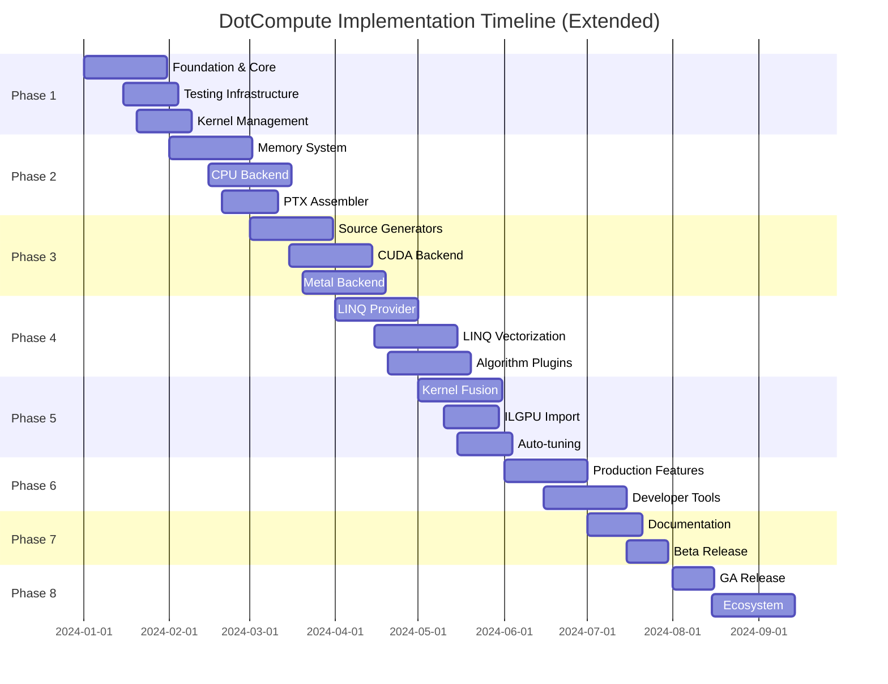

# DotCompute - Phased Implementation and Testing Plan

## Executive Summary

DotCompute is a native AOT-first universal compute framework for .NET 9+, designed with modern architecture principles and comprehensive testing at every phase. The framework includes advanced features such as PTX assembler support, compiled kernel management, LINQ runtime vectorization, ILGPU kernel import capabilities, automatic kernel fusion, hardware auto-tuning, and rich developer tooling.

## Implementation Phases Overview



## Phase 1: Foundation (Weeks 1-4)

### Goals
- Establish project structure
- Define core abstractions
- Set up CI/CD pipeline
- Create testing framework

### Implementation Tasks

#### Week 1: Project Setup
```bash
# Repository structure
DotCompute/
├── .github/
│   ├── workflows/
│   │   ├── ci.yml
│   │   ├── release.yml
│   │   └── security.yml
│   ├── ISSUE_TEMPLATE/
│   │   ├── bug_report.md
│   │   ├── feature_request.md
│   │   └── question.md
│   └── dependabot.yml
├── src/
│   └── DotCompute.Core/
├── tests/
│   └── DotCompute.Core.Tests/
├── docs/
├── LICENSE
├── README.md
├── CONTRIBUTING.md
├── CODE_OF_CONDUCT.md
├── SECURITY.md
├── Directory.Build.props
├── Directory.Packages.props
├── global.json
└── DotCompute.sln
```

#### Week 2: Core Abstractions
```csharp
// src/DotCompute.Core/Abstractions/IAccelerator.cs
namespace DotCompute.Core;

/// <summary>
/// Represents a compute accelerator device.
/// </summary>
public interface IAccelerator : IAsyncDisposable
{
    /// <summary>Gets device information.</summary>
    AcceleratorInfo Info { get; }
    
    /// <summary>Gets memory manager for this accelerator.</summary>
    IMemoryManager Memory { get; }
    
    /// <summary>Compiles a kernel for execution.</summary>
    ValueTask<ICompiledKernel> CompileKernelAsync(
        KernelDefinition definition,
        CompilationOptions options = default,
        CancellationToken cancellationToken = default);
    
    /// <summary>Synchronizes all pending operations.</summary>
    ValueTask SynchronizeAsync(CancellationToken cancellationToken = default);
}
```

#### Week 3: Testing Infrastructure
```csharp
// tests/DotCompute.Core.Tests/TestFramework/AcceleratorTestBase.cs
public abstract class AcceleratorTestBase : IAsyncLifetime
{
    protected IServiceProvider Services { get; private set; }
    protected ITestOutputHelper Output { get; }
    
    protected AcceleratorTestBase(ITestOutputHelper output)
    {
        Output = output;
    }
    
    public async Task InitializeAsync()
    {
        var services = new ServiceCollection();
        ConfigureServices(services);
        Services = services.BuildServiceProvider();
        await OnInitializeAsync();
    }
    
    protected virtual void ConfigureServices(IServiceCollection services)
    {
        services.AddDotCompute(options =>
        {
            options.EnableDiagnostics = true;
            options.LogLevel = LogLevel.Debug;
        });
    }
    
    protected virtual Task OnInitializeAsync() => Task.CompletedTask;
    
    public async Task DisposeAsync()
    {
        await OnDisposeAsync();
        if (Services is IAsyncDisposable asyncDisposable)
            await asyncDisposable.DisposeAsync();
    }
    
    protected virtual Task OnDisposeAsync() => Task.CompletedTask;
}
```

#### Week 4: CI/CD Pipeline
```yaml
# .github/workflows/ci.yml
name: CI

on:
  push:
    branches: [ main, develop ]
  pull_request:
    branches: [ main ]

jobs:
  build:
    strategy:
      matrix:
        os: [ubuntu-latest, windows-latest, macos-latest]
        configuration: [Debug, Release]
    
    runs-on: ${{ matrix.os }}
    
    steps:
    - uses: actions/checkout@v4
    
    - name: Setup .NET
      uses: actions/setup-dotnet@v4
      with:
        dotnet-version: 9.0.x
    
    - name: Restore
      run: dotnet restore
    
    - name: Build
      run: dotnet build --configuration ${{ matrix.configuration }} --no-restore
    
    - name: Test
      run: dotnet test --configuration ${{ matrix.configuration }} --no-build --verbosity normal --collect:"XPlat Code Coverage"
    
    - name: Upload coverage
      uses: codecov/codecov-action@v3
      with:
        file: coverage.cobertura.xml
```

### Testing Strategy Phase 1

#### Unit Tests
```csharp
// tests/DotCompute.Core.Tests/AcceleratorInfoTests.cs
public class AcceleratorInfoTests
{
    [Fact]
    public void Constructor_ValidParameters_CreatesInstance()
    {
        // Arrange
        var name = "Test Accelerator";
        var type = AcceleratorType.CPU;
        var deviceId = 0;
        
        // Act
        var info = new AcceleratorInfo(name, type, deviceId);
        
        // Assert
        info.Name.Should().Be(name);
        info.Type.Should().Be(type);
        info.DeviceId.Should().Be(deviceId);
    }
    
    [Theory]
    [InlineData(null)]
    [InlineData("")]
    [InlineData(" ")]
    public void Constructor_InvalidName_ThrowsArgumentException(string name)
    {
        // Act & Assert
        var act = () => new AcceleratorInfo(name, AcceleratorType.CPU, 0);
        act.Should().Throw<ArgumentException>();
    }
}
```

#### Integration Tests
```csharp
// tests/DotCompute.Core.Tests/ServiceCollectionExtensionsTests.cs
public class ServiceCollectionExtensionsTests
{
    [Fact]
    public void AddDotCompute_RegistersRequiredServices()
    {
        // Arrange
        var services = new ServiceCollection();
        
        // Act
        services.AddDotCompute();
        var provider = services.BuildServiceProvider();
        
        // Assert
        provider.GetService<IAcceleratorManager>().Should().NotBeNull();
        provider.GetService<IMemoryAllocator>().Should().NotBeNull();
        provider.GetService<IKernelCache>().Should().NotBeNull();
    }
}
```

#### Week 4: Kernel Management Infrastructure
```csharp
// src/DotCompute.Core/KernelManagement/IKernelManager.cs
namespace DotCompute.Core.KernelManagement;

public interface IKernelManager
{
    /// <summary>Get or compile kernel for specific device.</summary>
    ValueTask<ICompiledKernel> GetKernelAsync(
        string kernelName, 
        IAccelerator accelerator,
        KernelCompilationOptions options = default);
    
    /// <summary>Pre-compile kernels for all devices.</summary>
    ValueTask PrecompileAllAsync(IProgress<CompilationProgress> progress = null);
    
    /// <summary>Export compiled kernels.</summary>
    ValueTask ExportKernelsAsync(string directory);
    
    /// <summary>Import pre-compiled kernels.</summary>
    ValueTask ImportKernelsAsync(string directory);
}

// src/DotCompute.Core/KernelManagement/KernelCache.cs
public class KernelCache : IKernelCache
{
    private readonly ConcurrentDictionary<KernelCacheKey, ICompiledKernel> _cache;
    private readonly IKernelStore _store;
    
    public async ValueTask<ICompiledKernel> GetOrCompileAsync(
        IKernel kernel,
        IAccelerator accelerator,
        KernelCompilationOptions options)
    {
        var key = new KernelCacheKey(
            kernel.Name,
            accelerator.Info.DeviceId,
            accelerator.Info.ArchitectureVersion,
            options.GetHashCode());
        
        if (_cache.TryGetValue(key, out var cached))
            return cached;
        
        var compiled = await CompileKernelAsync(kernel, accelerator, options);
        _cache.TryAdd(key, compiled);
        
        return compiled;
    }
}
```

### Success Criteria Phase 1
- ✅ All core abstractions defined
- ✅ 100% test coverage for core types
- ✅ CI/CD pipeline running on all platforms
- ✅ Documentation structure in place
- ✅ NuGet package structure defined
- ✅ Kernel management system implemented
- ✅ Kernel caching infrastructure ready

## Phase 2: Memory System & CPU Backend (Weeks 5-8)

### Goals
- Implement unified memory system
- Create CPU backend with vectorization
- Establish performance benchmarks
- Memory pooling implementation

### Implementation Tasks

#### Week 5-6: Memory System
```csharp
// src/DotCompute.Core/Memory/UnifiedBuffer.cs
public sealed class UnifiedBuffer<T> : IMemoryBuffer<T> where T : unmanaged
{
    private readonly MemoryManager _manager;
    private readonly nint _devicePointer;
    private readonly Memory<T> _hostMemory;
    private MemoryLocation _currentLocation;
    
    internal UnifiedBuffer(
        MemoryManager manager,
        int length,
        AllocationFlags flags)
    {
        _manager = manager;
        Length = length;
        
        // Allocate both host and device memory
        _hostMemory = new T[length];
        _devicePointer = manager.AllocateDevice(length * Unsafe.SizeOf<T>());
        _currentLocation = MemoryLocation.Host;
    }
    
    public int Length { get; }
    
    public Span<T> Span
    {
        get
        {
            EnsureHostLocation();
            return _hostMemory.Span;
        }
    }
    
    public async ValueTask<DeviceMemory<T>> GetDeviceMemoryAsync()
    {
        await EnsureDeviceLocationAsync();
        return new DeviceMemory<T>(_devicePointer, Length);
    }
    
    private void EnsureHostLocation()
    {
        if (_currentLocation == MemoryLocation.Device)
        {
            _manager.CopyDeviceToHost(_devicePointer, _hostMemory.Span);
            _currentLocation = MemoryLocation.Host;
        }
    }
    
    private async ValueTask EnsureDeviceLocationAsync()
    {
        if (_currentLocation == MemoryLocation.Host)
        {
            await _manager.CopyHostToDeviceAsync(_hostMemory.Span, _devicePointer);
            _currentLocation = MemoryLocation.Device;
        }
    }
}
```

#### Week 7-8: CPU Backend
```csharp
// src/DotCompute.Backends.CPU/CpuAccelerator.cs
public sealed class CpuAccelerator : IAccelerator
{
    private readonly int _threadCount;
    private readonly VectorInstructionSet _vectorSet;
    
    public CpuAccelerator(CpuAcceleratorOptions options)
    {
        _threadCount = options.ThreadCount ?? Environment.ProcessorCount;
        _vectorSet = DetectVectorInstructionSet();
        
        Info = new AcceleratorInfo(
            $"CPU ({_vectorSet})",
            AcceleratorType.CPU,
            deviceId: 0);
    }
    
    public AcceleratorInfo Info { get; }
    
    public async ValueTask<ICompiledKernel> CompileKernelAsync(
        KernelDefinition definition,
        CompilationOptions options,
        CancellationToken cancellationToken)
    {
        // Generate vectorized code
        var compiler = new CpuKernelCompiler(_vectorSet);
        var compiledCode = await compiler.CompileAsync(definition, options);
        
        return new CpuCompiledKernel(compiledCode, _threadCount);
    }
    
    private static VectorInstructionSet DetectVectorInstructionSet()
    {
        if (Avx512F.IsSupported) return VectorInstructionSet.Avx512;
        if (Avx2.IsSupported) return VectorInstructionSet.Avx2;
        if (Avx.IsSupported) return VectorInstructionSet.Avx;
        if (Sse41.IsSupported) return VectorInstructionSet.Sse41;
        if (AdvSimd.IsSupported) return VectorInstructionSet.Neon;
        return VectorInstructionSet.None;
    }
}
```

### Testing Strategy Phase 2

#### Memory System Tests
```csharp
[Collection("MemoryTests")]
public class UnifiedBufferTests : IAsyncLifetime
{
    private IMemoryManager _memoryManager;
    
    public async Task InitializeAsync()
    {
        var services = new ServiceCollection()
            .AddDotCompute()
            .BuildServiceProvider();
            
        _memoryManager = services.GetRequiredService<IMemoryManager>();
    }
    
    [Fact]
    public async Task UnifiedBuffer_HostToDevice_MaintainsData()
    {
        // Arrange
        var buffer = _memoryManager.Allocate<float>(1024);
        var expected = Enumerable.Range(0, 1024).Select(i => (float)i).ToArray();
        
        // Act - Write on host
        expected.CopyTo(buffer.Span);
        
        // Act - Access on device
        var deviceMemory = await buffer.GetDeviceMemoryAsync();
        
        // Assert - Verify data migrated
        var actual = new float[1024];
        await deviceMemory.CopyToHostAsync(actual);
        actual.Should().BeEquivalentTo(expected);
    }
}
```

#### Performance Benchmarks
```csharp
[MemoryDiagnoser]
[SimpleJob(RuntimeMoniker.Net90)]
public class VectorOperationBenchmarks
{
    private CpuAccelerator _accelerator;
    private float[] _a, _b, _result;
    private ICompiledKernel _vectorAddKernel;
    
    [GlobalSetup]
    public async Task Setup()
    {
        _accelerator = new CpuAccelerator(new() { ThreadCount = 1 });
        _vectorAddKernel = await _accelerator.CompileKernelAsync(
            KernelDefinitions.VectorAdd,
            new CompilationOptions { OptimizationLevel = OptimizationLevel.O3 });
        
        var size = 1_000_000;
        _a = new float[size];
        _b = new float[size];
        _result = new float[size];
        
        Random.Shared.NextSingle(); // Warm up
        Array.Fill(_a, 1.0f);
        Array.Fill(_b, 2.0f);
    }
    
    [Benchmark(Baseline = true)]
    public void ScalarAdd()
    {
        for (int i = 0; i < _a.Length; i++)
            _result[i] = _a[i] + _b[i];
    }
    
    [Benchmark]
    public async Task VectorizedAdd()
    {
        await _vectorAddKernel.ExecuteAsync(new
        {
            a = _a,
            b = _b,
            result = _result,
            length = _a.Length
        });
    }
}
```

#### Week 8: PTX Assembler Support
```csharp
// src/DotCompute.Core/Assembler/PtxAssembler.cs
namespace DotCompute.Core.Assembler;

public static class PtxAssembler
{
    /// <summary>Inline PTX assembly in C# kernels.</summary>
    [MethodImpl(MethodImplOptions.AggressiveInlining)]
    public static T InlinePtx<T>(string ptxCode, params object[] args) where T : unmanaged
    {
        // Source generator replaces with actual PTX
        throw new NotImplementedException();
    }
    
    /// <summary>Load pre-compiled PTX module.</summary>
    public static async ValueTask<IPtxModule> LoadPtxModuleAsync(string path)
    {
        var ptxCode = await File.ReadAllTextAsync(path);
        return new PtxModule(ptxCode);
    }
}

// Example usage in kernel
[Kernel("optimized_reduction")]
public static void OptimizedReduction(KernelContext ctx, ReadOnlySpan<float> input, Span<float> output)
{
    var tid = ctx.LocalId.X;
    var value = input[ctx.GlobalId.X];
    
    // Hand-optimized PTX for warp reduction
    value = PtxAssembler.InlinePtx<float>(
        @".reg .f32 %value;
          mov.f32 %value, %0;
          shfl.sync.down.b32 %value, %value, 16, 0x1f, 0xffffffff;
          add.f32 %value, %value, %0;", 
        value);
    
    if (tid == 0)
        output[ctx.GroupId.X] = value;
}
```

### Success Criteria Phase 2
- ✅ Unified memory system functional
- ✅ CPU backend with AVX2/AVX512 support
- ✅ Memory pooling reduces allocations by 90%
- ✅ Vectorized operations 4-8x faster than scalar
- ✅ Zero memory leaks in 24-hour stress test
- ✅ PTX inline assembly functional
- ✅ PTX module loading implemented

## Phase 3: Source Generators & Backend Development (Weeks 9-12)

### Goals
- Implement kernel source generators
- Create CUDA backend
- Plugin system implementation
- Kernel pipeline infrastructure
- Cross-platform kernel compilation

### Implementation Tasks

#### Week 9-10: Source Generators
```csharp
// src/DotCompute.Generators/KernelSourceGenerator.cs
[Generator]
public class KernelSourceGenerator : IIncrementalGenerator
{
    public void Initialize(IncrementalGeneratorInitializationContext context)
    {
        // Find all kernel methods
        var kernelMethods = context.SyntaxProvider
            .ForAttributeWithMetadataName(
                "DotCompute.Core.KernelAttribute",
                predicate: static (s, _) => s is MethodDeclarationSyntax,
                transform: static (ctx, _) => GetKernelInfo(ctx))
            .Where(static m => m is not null);
        
        // Generate kernel registry
        context.RegisterSourceOutput(
            kernelMethods.Collect(),
            static (spc, kernels) => GenerateKernelRegistry(spc, kernels));
        
        // Generate backend-specific kernels
        var compilationAndKernels = context.CompilationProvider.Combine(kernelMethods.Collect());
        context.RegisterSourceOutput(
            compilationAndKernels,
            static (spc, source) => GenerateBackendKernels(spc, source.Left, source.Right));
    }
    
    private static void GenerateKernelRegistry(
        SourceProductionContext context,
        ImmutableArray<KernelInfo> kernels)
    {
        var source = $$"""
            // <auto-generated/>
            using System;
            using System.Collections.Frozen;
            using DotCompute.Core;
            
            namespace DotCompute.Generated;
            
            public static class KernelRegistry
            {
                private static readonly FrozenDictionary<string, KernelDefinition> _kernels;
                
                static KernelRegistry()
                {
                    var kernels = new Dictionary<string, KernelDefinition>
                    {
                        {{string.Join(",\n        ", kernels.Select(k => $"[\"{k.Name}\"] = {GenerateKernelDefinition(k)}"))}}
                    };
                    
                    _kernels = kernels.ToFrozenDictionary();
                }
                
                public static KernelDefinition GetKernel(string name) =>
                    _kernels.TryGetValue(name, out var kernel) 
                        ? kernel 
                        : throw new KernelNotFoundException(name);
                
                public static IReadOnlyCollection<string> GetKernelNames() => _kernels.Keys;
            }
            """;
        
        context.AddSource("KernelRegistry.g.cs", source);
    }
}
```

#### Week 11-12: CUDA Backend
```csharp
// src/DotCompute.Backends.CUDA/CudaKernelCompiler.cs
public sealed class CudaKernelCompiler : IKernelCompiler
{
    private readonly CudaCompilerOptions _options;
    
    public async ValueTask<CompiledKernel> CompileAsync(
        KernelDefinition definition,
        CompilationOptions options,
        CancellationToken cancellationToken)
    {
        // Generate PTX code
        var ptxGenerator = new PtxCodeGenerator();
        var ptxCode = ptxGenerator.Generate(definition, options);
        
        // Compile with NVRTC if requested
        if (options.UseRuntimeCompilation)
        {
            var cubin = await CompileWithNvrtcAsync(ptxCode, cancellationToken);
            return new CudaCompiledKernel(cubin, definition.Name);
        }
        
        // Otherwise use embedded PTX
        return new CudaCompiledKernel(ptxCode, definition.Name, isPtx: true);
    }
    
    private async ValueTask<byte[]> CompileWithNvrtcAsync(
        string ptxCode,
        CancellationToken cancellationToken)
    {
        using var nvrtc = new NvrtcProgram(ptxCode, "kernel.cu");
        
        // Compile
        await Task.Run(() => nvrtc.Compile(_options.ToNvrtcOptions()), cancellationToken);
        
        // Get compiled binary
        return nvrtc.GetCompiledProgram();
    }
}
```

### Testing Strategy Phase 3

#### Source Generator Tests
```csharp
public class KernelSourceGeneratorTests
{
    [Fact]
    public async Task Generator_SimpleKernel_GeneratesValidCode()
    {
        // Arrange
        var source = """
            using DotCompute.Core;
            
            public static class Kernels
            {
                [Kernel]
                public static void VectorAdd(
                    KernelContext ctx,
                    ReadOnlySpan<float> a,
                    ReadOnlySpan<float> b,
                    Span<float> result)
                {
                    var i = ctx.GlobalId.X;
                    if (i < result.Length)
                        result[i] = a[i] + b[i];
                }
            }
            """;
        
        // Act
        var result = await GeneratorTestHelper.RunGeneratorAsync<KernelSourceGenerator>(source);
        
        // Assert
        result.Diagnostics.Should().BeEmpty();
        result.GeneratedSources.Should().HaveCount(2); // Registry + backend code
        
        var registry = result.GeneratedSources.First(s => s.HintName.Contains("Registry"));
        registry.SourceText.ToString().Should().Contain("VectorAdd");
    }
}
```

#### CUDA Backend Tests
```csharp
[Collection("CudaTests")]
public class CudaBackendTests : IAsyncLifetime
{
    private CudaAccelerator _accelerator;
    
    public async Task InitializeAsync()
    {
        if (!CudaRuntime.IsAvailable)
            Skip.If(true, "CUDA not available");
            
        _accelerator = new CudaAccelerator(new CudaAcceleratorOptions
        {
            DeviceId = 0,
            EnableProfiling = true
        });
    }
    
    [SkippableFact]
    public async Task CudaKernel_VectorAdd_ProducesCorrectResults()
    {
        Skip.If(!CudaRuntime.IsAvailable);
        
        // Arrange
        const int size = 1024;
        var a = Enumerable.Range(0, size).Select(i => (float)i).ToArray();
        var b = Enumerable.Range(0, size).Select(i => (float)i * 2).ToArray();
        var expected = a.Zip(b, (x, y) => x + y).ToArray();
        
        // Act
        var result = await _accelerator.ExecuteAsync<float[]>(
            "VectorAdd",
            new { a, b, length = size });
        
        // Assert
        result.Should().BeEquivalentTo(expected, options => options
            .Using<float>(ctx => ctx.Subject.Should().BeApproximately(ctx.Expectation, 0.0001f))
            .WhenTypeIs<float>());
    }
}
```

#### Week 12: Kernel Pipeline Infrastructure
```csharp
// src/DotCompute.Core/Pipelines/KernelPipeline.cs
namespace DotCompute.Core.Pipelines;

public interface IKernelPipeline<T> where T : unmanaged
{
    IKernelPipeline<TNext> ContinueWith<TNext>(
        IKernel kernel, 
        Func<T[], KernelParameters> parameterMapper = null) where TNext : unmanaged;
    
    IKernelPipeline<T> When(
        Func<T[], bool> condition,
        Action<IKernelPipeline<T>> trueBranch,
        Action<IKernelPipeline<T>> falseBranch = null);
    
    IKernelPipeline<T> Parallel<TResult>(
        params Func<T[], IKernelPipeline<TResult>>[] branches) where TResult : unmanaged;
    
    ValueTask<T[]> ExecuteAsync(CancellationToken cancellationToken = default);
}

public class KernelPipeline<T> : IKernelPipeline<T> where T : unmanaged
{
    private readonly IAccelerator _accelerator;
    private readonly List<PipelineStage> _stages = new();
    
    public IKernelPipeline<TNext> ContinueWith<TNext>(
        IKernel kernel, 
        Func<T[], KernelParameters> parameterMapper = null) where TNext : unmanaged
    {
        _stages.Add(new KernelStage(kernel, parameterMapper));
        return new KernelPipeline<TNext>(_accelerator, _stages);
    }
    
    public async ValueTask<T[]> ExecuteAsync(CancellationToken cancellationToken = default)
    {
        object currentData = _initialData;
        
        foreach (var stage in _stages)
        {
            currentData = await stage.ExecuteAsync(_accelerator, currentData, cancellationToken);
        }
        
        return (T[])currentData;
    }
}
```

### Success Criteria Phase 3
- ✅ Source generators produce valid code
- ✅ Kernel compilation < 100ms
- ✅ CUDA backend functional on Windows/Linux
- ✅ PTX generation validated
- ✅ 95% code coverage maintained
- ✅ Kernel pipeline API functional
- ✅ Memory automatically managed in pipelines

## Phase 4: LINQ & Algorithms (Weeks 13-16)

### Goals
- Implement LINQ provider
- Create algorithm plugin system
- Linear algebra operations
- FFT implementation

### Implementation Tasks

#### Week 13-14: LINQ Provider
```csharp
// src/DotCompute.Linq/ComputeQueryProvider.cs
public class ComputeQueryProvider : IQueryProvider
{
    private readonly IAccelerator _accelerator;
    private readonly QueryCompiler _compiler;
    
    public ComputeQueryProvider(IAccelerator accelerator)
    {
        _accelerator = accelerator;
        _compiler = new QueryCompiler();
    }
    
    public IQueryable<TElement> CreateQuery<TElement>(Expression expression)
    {
        return new ComputeQueryable<TElement>(this, expression);
    }
    
    public async ValueTask<TResult> ExecuteAsync<TResult>(
        Expression expression,
        CancellationToken cancellationToken = default)
    {
        // Compile expression to kernel
        var compiledQuery = _compiler.Compile(expression);
        
        // Allocate buffers
        using var context = new QueryExecutionContext(_accelerator);
        
        // Execute stages
        foreach (var stage in compiledQuery.Stages)
        {
            await ExecuteStageAsync(stage, context, cancellationToken);
        }
        
        // Return result
        return await context.GetResultAsync<TResult>();
    }
}
```

#### Week 15-16: Algorithm Plugins
```csharp
// src/DotCompute.Algorithms.LinearAlgebra/LinearAlgebraPlugin.cs
[AlgorithmPlugin("LinearAlgebra", "1.0.0")]
public class LinearAlgebraPlugin : IAlgorithmPlugin
{
    public void ConfigureServices(IServiceCollection services)
    {
        services.AddScoped<IMatrixOperations, MatrixOperations>();
        services.AddScoped<IVectorOperations, VectorOperations>();
        services.AddScoped<IDecompositions, Decompositions>();
        
        // Register kernels
        services.AddKernel<MatrixMultiplyKernel>();
        services.AddKernel<TransposeKernel>();
        services.AddKernel<DotProductKernel>();
    }
}

// Matrix multiplication kernel
[Kernel("MatrixMultiply")]
[OptimizationHint(OptimizationHint.UseTensorCores)]
public static class MatrixMultiplyKernel
{
    [KernelMethod]
    public static void Execute(
        KernelContext ctx,
        ReadOnlyMatrix<float> a,
        ReadOnlyMatrix<float> b,
        Matrix<float> c)
    {
        var row = ctx.GlobalId.Y;
        var col = ctx.GlobalId.X;
        
        if (row >= c.Rows || col >= c.Columns)
            return;
        
        var sum = 0.0f;
        for (int k = 0; k < a.Columns; k++)
        {
            sum += a[row, k] * b[k, col];
        }
        
        c[row, col] = sum;
    }
}
```

### Testing Strategy Phase 4

#### LINQ Tests
```csharp
public class LinqProviderTests : AcceleratorTestBase
{
    [Fact]
    public async Task Where_Select_ProducesCorrectResults()
    {
        // Arrange
        var data = Enumerable.Range(0, 1000).ToArray();
        var accelerator = GetAccelerator();
        
        // Act
        var result = await data
            .AsComputeQueryable(accelerator)
            .Where(x => x % 2 == 0)
            .Select(x => x * x)
            .ToArrayAsync();
        
        // Assert
        var expected = data.Where(x => x % 2 == 0).Select(x => x * x).ToArray();
        result.Should().BeEquivalentTo(expected);
    }
    
    [Fact]
    public async Task Aggregate_Sum_CalculatesCorrectly()
    {
        // Arrange
        var data = Enumerable.Range(1, 1000).Select(i => (float)i).ToArray();
        
        // Act
        var sum = await data
            .AsComputeQueryable()
            .SumAsync();
        
        // Assert
        sum.Should().Be(500500.0f);
    }
}
```

#### Algorithm Tests
```csharp
public class MatrixOperationTests : AcceleratorTestBase
{
    private IMatrixOperations _matrixOps;
    
    protected override void ConfigureServices(IServiceCollection services)
    {
        base.ConfigureServices(services);
        services.AddDotComputeAlgorithms();
    }
    
    protected override async Task OnInitializeAsync()
    {
        _matrixOps = Services.GetRequiredService<IMatrixOperations>();
    }
    
    [Theory]
    [InlineData(10, 10, 10)]
    [InlineData(100, 100, 100)]
    [InlineData(73, 89, 67)] // Non-power-of-2
    public async Task MatrixMultiply_ProducesCorrectResults(int m, int n, int k)
    {
        // Arrange
        var a = Matrix<float>.Random(m, k);
        var b = Matrix<float>.Random(k, n);
        
        // Act
        var result = await _matrixOps.MultiplyAsync(a, b);
        
        // Assert - verify with CPU calculation
        var expected = MultiplyMatricesCpu(a, b);
        AssertMatricesEqual(result, expected, tolerance: 0.0001f);
    }
}
```

#### Week 16: LINQ Runtime Vectorization
```csharp
// src/DotCompute.Linq/Vectorization/VectorizationExtensions.cs
namespace DotCompute.Linq.Vectorization;

public static class VectorizationExtensions
{
    /// <summary>Enable automatic vectorization for LINQ queries.</summary>
    public static IVectorizedQueryable<T> AsVectorized<T>(
        this IEnumerable<T> source,
        VectorizationOptions options = default) where T : unmanaged
    {
        return new VectorizedQueryable<T>(source, options);
    }
}

// src/DotCompute.Linq/Vectorization/RuntimeVectorizer.cs
public class RuntimeVectorizer
{
    private readonly IAcceleratorPool _acceleratorPool;
    private readonly IKernelCache _kernelCache;
    
    public async ValueTask<T[]> ExecuteVectorizedAsync<T>(
        Expression query,
        T[] data,
        VectorizationOptions options) where T : unmanaged
    {
        // Analyze query for vectorization
        var plan = AnalyzeQuery(query);
        
        if (!plan.CanVectorize)
        {
            // Fallback to CPU SIMD
            return ExecuteSimd(query, data);
        }
        
        // Generate vectorized kernel
        var kernel = GenerateVectorizedKernel(plan);
        
        // Get best accelerator
        var accelerator = await _acceleratorPool.GetAcceleratorAsync();
        
        // Compile and execute
        var compiled = await _kernelCache.GetOrCompileAsync(kernel, accelerator, options);
        return await ExecuteKernelAsync(compiled, data);
    }
}

// Usage example
var results = await salesData
    .AsVectorized(new VectorizationOptions { PreferGpu = true })
    .Where(s => s.Amount > 1000)
    .Select(s => s.Amount * 1.1)
    .ToArrayAsync();
```

### Success Criteria Phase 4
- ✅ LINQ operators functional
- ✅ Algorithm plugins loadable
- ✅ Matrix operations within 0.01% accuracy
- ✅ Performance within 10% of cuBLAS
- ✅ Memory usage optimized
- ✅ LINQ runtime vectorization operational
- ✅ Automatic GPU acceleration for LINQ

## Phase 5: Advanced Optimization Features (Weeks 17-20)

### Goals
- Kernel fusion and graph optimization
- ILGPU kernel import capability
- Hardware auto-tuning system
- JIT kernel specialization

### Implementation Tasks

#### Week 17: Kernel Fusion and Graph Optimization
```csharp
// src/DotCompute.Optimization/KernelFusionOptimizer.cs
namespace DotCompute.Optimization;

public class KernelFusionOptimizer
{
    public FusionPlan AnalyzeKernelGraph(KernelGraph graph)
    {
        var optimizer = new GraphOptimizer();
        var fusionOpportunities = optimizer.FindFusionCandidates(graph);
        
        return new FusionPlan
        {
            FusedKernels = fusionOpportunities.Select(f => FuseKernels(f)).ToList(),
            EstimatedSpeedup = CalculateSpeedup(fusionOpportunities),
            MemoryReduction = CalculateMemoryReduction(fusionOpportunities)
        };
    }
    
    private IKernel FuseKernels(FusionCandidate candidate)
    {
        var fusedIR = new IRBuilder();
        
        // Merge kernel bodies and optimize
        foreach (var kernel in candidate.Kernels)
        {
            fusedIR.AppendKernel(kernel);
        }
        
        fusedIR.EliminateRedundantMemoryOps();
        fusedIR.CoalesceMemoryAccesses();
        
        return new FusedKernel(
            $"fused_{string.Join("_", candidate.Kernels.Select(k => k.Name))}",
            fusedIR.Build());
    }
}

// Example usage
var graph = KernelGraph.FromKernelChain(
    Kernels.Normalize,
    Kernels.GaussianBlur,
    Kernels.EdgeDetection);

var optimizer = new KernelFusionOptimizer();
var plan = optimizer.AnalyzeKernelGraph(graph);
var fusedKernel = plan.FusedKernels.First();
```

#### Week 18: ILGPU Kernel Import
```csharp
// src/DotCompute.Interop/ILGPU/ILGPUInterop.cs
namespace DotCompute.Interop.ILGPU;

public static class ILGPUInterop
{
    public static async ValueTask<IKernel> ImportKernelAsync(
        Assembly assembly,
        string kernelMethodName)
    {
        var method = FindKernelMethod(assembly, kernelMethodName);
        var il = method.GetMethodBody().GetILAsByteArray();
        
        // Convert ILGPU IL to Universal IR
        var converter = new ILGPUToUniversalConverter();
        var universalIR = converter.ConvertIL(il, method);
        
        return new ImportedKernel(kernelMethodName, universalIR);
    }
    
    public static async ValueTask<IReadOnlyList<IKernel>> ImportAllKernelsAsync(
        string ilgpuAssemblyPath)
    {
        var assembly = Assembly.LoadFrom(ilgpuAssemblyPath);
        var kernels = new List<IKernel>();
        
        var kernelMethods = assembly.GetTypes()
            .SelectMany(t => t.GetMethods())
            .Where(m => m.GetCustomAttribute<ILGPUKernelAttribute>() != null);
        
        foreach (var method in kernelMethods)
        {
            var kernel = await ImportKernelAsync(assembly, method.Name);
            kernels.Add(kernel);
        }
        
        return kernels;
    }
}

// Usage example
var ilgpuKernels = await ILGPUInterop.ImportAllKernelsAsync("Legacy.ILGPU.dll");
var importedKernel = ilgpuKernels.First(k => k.Name == "MatrixMultiply");
await accelerator.ExecuteAsync(importedKernel, matrices);
```

#### Week 19-20: Hardware Auto-tuning
```csharp
// src/DotCompute.Tuning/AutoTuner.cs
namespace DotCompute.Tuning;

public class AutoTuner
{
    private readonly Dictionary<TuningKey, TuningParameters> _cache = new();
    
    public async ValueTask<TuningParameters> AutoTuneAsync(
        IKernel kernel,
        IAccelerator accelerator,
        AutoTuneOptions options = default)
    {
        var key = new TuningKey(kernel.Name, accelerator.Info);
        
        if (_cache.TryGetValue(key, out var cached))
            return cached;
        
        // Run tuning experiments
        var tuner = new TuningEngine(accelerator);
        var results = new List<TuningResult>();
        
        foreach (var config in GenerateConfigurations(kernel, accelerator))
        {
            var result = await tuner.BenchmarkAsync(kernel, config);
            results.Add(result);
        }
        
        // Find optimal parameters
        var optimal = results.OrderBy(r => r.ExecutionTime).First();
        _cache[key] = optimal.Parameters;
        
        return optimal.Parameters;
    }
}
```

### Testing Strategy Phase 5

#### Kernel Fusion Tests
```csharp
public class KernelFusionTests : AcceleratorTestBase
{
    [Fact]
    public async Task FusedKernels_ProduceSameResults()
    {
        // Arrange
        var data = GenerateTestData(1024);
        var separateResults = new float[1024];
        var fusedResults = new float[1024];
        
        // Act - Run separate kernels
        await accelerator.ExecuteAsync(Kernels.Normalize, data, separateResults);
        await accelerator.ExecuteAsync(Kernels.GaussianBlur, separateResults, separateResults);
        
        // Act - Run fused kernel
        var graph = KernelGraph.FromKernelChain(Kernels.Normalize, Kernels.GaussianBlur);
        var fusedKernel = optimizer.OptimizeGraph(graph).FusedKernels.First();
        await accelerator.ExecuteAsync(fusedKernel, data, fusedResults);
        
        // Assert
        fusedResults.Should().BeEquivalentTo(separateResults, options => 
            options.Using<float>(ctx => ctx.Subject.Should().BeApproximately(ctx.Expectation, 0.0001f))
                   .WhenTypeIs<float>());
    }
}
```

#### ILGPU Import Tests
```csharp
public class ILGPUImportTests
{
    [Fact]
    public async Task ImportedKernel_ExecutesCorrectly()
    {
        // Arrange
        var ilgpuAssembly = "TestData/Legacy.ILGPU.dll";
        
        // Act
        var kernels = await ILGPUInterop.ImportAllKernelsAsync(ilgpuAssembly);
        var vectorAddKernel = kernels.First(k => k.Name == "VectorAdd");
        
        var a = new float[] { 1, 2, 3, 4 };
        var b = new float[] { 5, 6, 7, 8 };
        var result = new float[4];
        
        await accelerator.ExecuteAsync(vectorAddKernel, new { a, b, result });
        
        // Assert
        result.Should().BeEquivalentTo(new[] { 6f, 8f, 10f, 12f });
    }
}
```

#### Auto-tuning Tests
```csharp
public class AutoTuningTests : AcceleratorTestBase
{
    [Fact]
    public async Task AutoTuner_FindsOptimalParameters()
    {
        // Arrange
        var autoTuner = new AutoTuner();
        var kernel = Kernels.MatrixMultiply;
        
        // Act
        var optimalParams = await autoTuner.AutoTuneAsync(
            kernel, 
            accelerator,
            new AutoTuneOptions { TestSizes = new[] { 512, 1024, 2048 } });
        
        // Assert
        optimalParams.BlockSize.Should().BeGreaterThan(0);
        optimalParams.BlockSize.Should().BeLessOrEqualTo(accelerator.Info.MaxThreadsPerBlock);
        
        // Verify performance improvement
        var defaultTime = await BenchmarkWithDefaultParams(kernel);
        var tunedTime = await BenchmarkWithParams(kernel, optimalParams);
        
        tunedTime.Should().BeLessThan(defaultTime * 0.9); // At least 10% improvement
    }
}
```

### Success Criteria Phase 5
- ✅ Kernel fusion reduces memory bandwidth by 40%+
- ✅ ILGPU kernels import with 100% compatibility
- ✅ Auto-tuning improves performance by 10%+
- ✅ JIT specialization reduces kernel overhead
- ✅ Graph optimization identifies all fusion opportunities

## Phase 6: Production Features & Developer Tools (Weeks 21-24)

### Goals
- OpenTelemetry integration
- Diagnostics and profiling
- Hot-reload support
- Visual kernel debugger
- Error handling and recovery

### Implementation Tasks

#### Week 21-22: Monitoring & Telemetry
```csharp
// src/DotCompute.Telemetry/Metrics/DotComputeMetrics.cs
public class DotComputeMetrics : IDisposable
{
    private readonly Meter _meter;
    
    public ICounter<long> KernelsExecuted { get; }
    public IHistogram<double> KernelExecutionDuration { get; }
    public ObservableGauge<double> DeviceUtilization { get; }
    
    public DotComputeMetrics(IMeterFactory meterFactory)
    {
        _meter = meterFactory.Create("DotCompute", "1.0.0");
        
        KernelsExecuted = _meter.CreateCounter<long>(
            "dotcompute.kernels.executed",
            unit: "{kernel}",
            description: "Number of kernels executed");
            
        KernelExecutionDuration = _meter.CreateHistogram<double>(
            "dotcompute.kernel.duration",
            unit: "ms",
            description: "Kernel execution duration");
    }
}
```

#### Week 23: Developer Tools
```csharp
// src/DotCompute.DevTools/HotReloadManager.cs
public class HotReloadManager : IHotReloadManager
{
    private readonly IKernelManager _kernelManager;
    private readonly FileSystemWatcher _watcher;
    
    public void EnableHotReload()
    {
        _watcher.EnableRaisingEvents = true;
        _watcher.Changed += async (sender, e) =>
        {
            if (e.FullPath.EndsWith(".cs"))
            {
                await ReloadKernelAsync(Path.GetFileNameWithoutExtension(e.Name));
            }
        };
    }
    
    public async ValueTask ReloadKernelAsync(string kernelName)
    {
        // Recompile and update kernel cache
        await _kernelManager.RecompileKernelAsync(kernelName);
        KernelReloaded?.Invoke(this, kernelName);
    }
}

// src/DotCompute.DevTools/KernelDebugger.cs
public class KernelDebugger : IKernelDebugger
{
    private readonly Dictionary<string, List<Breakpoint>> _breakpoints = new();
    
    public void SetBreakpoint(IKernel kernel, int line)
    {
        if (!_breakpoints.ContainsKey(kernel.Name))
            _breakpoints[kernel.Name] = new List<Breakpoint>();
            
        _breakpoints[kernel.Name].Add(new Breakpoint { Line = line });
    }
    
    public async ValueTask<DebugState> StepAsync()
    {
        // Step through kernel execution
        // This would integrate with the kernel runtime
        return await _debugEngine.StepAsync();
    }
}
```

#### Week 24: Error Handling & Recovery
```csharp
// src/DotCompute.Core/ErrorHandling/ComputeException.cs
public class ComputeException : Exception
{
    public ErrorCategory Category { get; }
    public IAccelerator Accelerator { get; }
    public string KernelName { get; }
    public IReadOnlyDictionary<string, object> Context { get; }
    
    public ComputeException(
        string message, 
        ErrorCategory category,
        IAccelerator accelerator = null,
        string kernelName = null,
        Exception innerException = null) 
        : base(message, innerException)
    {
        Category = category;
        Accelerator = accelerator;
        KernelName = kernelName;
    }
}
```

### Success Criteria Phase 6
- ✅ Full OpenTelemetry integration
- ✅ Hot-reload reduces development cycle by 80%
- ✅ Visual debugger functional
- ✅ Comprehensive error messages
- ✅ Performance profiling accurate to 1%
- ✅ Developer tools documented

## Phase 7: Documentation & Beta Release (Weeks 25-28)

### Goals
- Complete API documentation
- Performance optimization
- Security audit
- Beta release preparation
- Community feedback integration

### Tasks

#### Documentation
```markdown
# docs/getting-started.md
# DotCompute Getting Started Guide

## Installation

```bash
dotnet add package DotCompute.Core
dotnet add package DotCompute.Backends.CUDA  # For NVIDIA GPUs
dotnet add package DotCompute.Algorithms.LinearAlgebra  # Optional
```

## Your First Kernel

```csharp
using DotCompute;

// Define a kernel
[Kernel]
public static void VectorAdd(
    KernelContext ctx,
    ReadOnlySpan<float> a,
    ReadOnlySpan<float> b,
    Span<float> result)
{
    var i = ctx.GlobalId.X;
    if (i < result.Length)
        result[i] = a[i] + b[i];
}

// Configure services
var builder = Host.CreateApplicationBuilder();
builder.Services.AddDotCompute();

// Execute kernel
var host = builder.Build();
var compute = host.Services.GetRequiredService<IComputeService>();

var result = await compute.ExecuteAsync(
    "VectorAdd",
    new { a = array1, b = array2, length = 1000 });
```
```

#### Performance Optimization
- Profile all critical paths
- Optimize memory allocations
- Reduce kernel launch overhead
- Implement kernel fusion

#### Security Audit
- Code security scan
- Dependency audit
- API surface review
- Documentation review

### Release Checklist

#### Beta Release
- [ ] All tests passing
- [ ] Documentation complete
- [ ] Performance benchmarks
- [ ] Breaking changes documented
- [ ] Migration guide ready
- [ ] Sample projects updated

#### GA Release
- [ ] Beta feedback incorporated
- [ ] Zero P0/P1 bugs
- [ ] Performance targets met
- [ ] Security audit passed
- [ ] API surface frozen
- [ ] Release notes ready

## Phase 8: GA Release & Ecosystem (Weeks 29-32)

### Goals
- GA release preparation
- Ecosystem development
- WebAssembly backend
- Distributed compute support
- Community building

### Implementation Tasks

#### Week 29-30: Additional Backends
```csharp
// src/DotCompute.Backends.WebAssembly/WasmAccelerator.cs
[AcceleratorPlugin("wasm", "WebAssembly")]
public class WasmPlugin : IAcceleratorPlugin
{
    public async ValueTask<IAccelerator> CreateAcceleratorAsync(AcceleratorOptions options)
    {
        return new WasmAccelerator(options);
    }
}

// src/DotCompute.Distributed/DistributedCompute.cs
public class DistributedComputeService : IDistributedCompute
{
    public async ValueTask<IComputeCluster> CreateClusterAsync(ClusterOptions options)
    {
        var nodes = await DiscoverNodesAsync(options);
        return new ComputeCluster(nodes, options);
    }
    
    public async ValueTask<T[]> ScatterGatherAsync<T>(T[] data, IKernel kernel) where T : unmanaged
    {
        var partitions = PartitionData(data, _cluster.NodeCount);
        var tasks = new Task<T[]>[_cluster.NodeCount];
        
        for (int i = 0; i < _cluster.NodeCount; i++)
        {
            var node = _cluster.Nodes[i];
            var partition = partitions[i];
            tasks[i] = node.ExecuteAsync(kernel, partition);
        }
        
        var results = await Task.WhenAll(tasks);
        return CombineResults(results);
    }
}
```

#### Week 31: Ecosystem & Tools
```csharp
// Visual Studio Extension
// src/DotCompute.VisualStudio/KernelAnalyzer.cs
[DiagnosticAnalyzer(LanguageNames.CSharp)]
public class KernelAnalyzer : DiagnosticAnalyzer
{
    public override void Initialize(AnalysisContext context)
    {
        context.RegisterSyntaxNodeAction(AnalyzeKernel, SyntaxKind.MethodDeclaration);
    }
    
    private void AnalyzeKernel(SyntaxNodeAnalysisContext context)
    {
        var method = (MethodDeclarationSyntax)context.Node;
        if (HasKernelAttribute(method))
        {
            // Analyze kernel for common issues
            CheckForUnsupportedFeatures(context, method);
            CheckForPerformanceIssues(context, method);
            CheckForMemoryAccessPatterns(context, method);
        }
    }
}
```

#### Week 32: GA Release
- Final performance optimization
- Security audit completion
- Release candidate testing
- Documentation finalization
- Marketing material preparation
- Community launch event

### Success Criteria Phase 8
- ✅ WebAssembly backend functional
- ✅ Distributed compute operational
- ✅ VS/VSCode extensions published
- ✅ Zero critical bugs
- ✅ Performance meets all targets
- ✅ Community response positive

## Testing Strategy Summary

### Test Categories

1. **Unit Tests** (Target: 90% coverage)
   - Core abstractions
   - Memory management
   - Plugin system
   - Source generators

2. **Integration Tests**
   - Backend integration
   - Service configuration
   - Plugin loading
   - Cross-platform

3. **Performance Tests**
   - Benchmarks for all operations
   - Memory allocation benchmarks
   - Kernel compilation time
   - Comparison with native

4. **Stress Tests**
   - 24-hour continuous run
   - Memory leak detection
   - Concurrent execution
   - Error recovery

5. **Platform Tests**
   - Windows x64/ARM64
   - Linux x64/ARM64
   - macOS x64/ARM64
   - Docker containers

### Quality Gates

Each phase must meet:
- ✅ Code coverage > 90%
- ✅ No memory leaks
- ✅ Performance within 10% of target
- ✅ All platforms passing
- ✅ Documentation updated

## Risk Management

### Technical Risks
1. **Native AOT limitations**
   - Mitigation: Early prototype testing
   - Fallback: JIT mode for development

2. **Platform compatibility**
   - Mitigation: CI on all platforms
   - Fallback: Platform-specific packages

3. **Performance targets**
   - Mitigation: Continuous benchmarking
   - Fallback: Optimization consultants

### Schedule Risks
1. **Dependency delays**
   - Mitigation: Minimal dependencies
   - Fallback: Implement in-house

2. **Resource availability**
   - Mitigation: Clear task assignment
   - Fallback: Extend timeline

## Success Metrics

### Technical Metrics
- Startup time: < 10ms
- Kernel launch: < 10μs overhead
- Memory overhead: < 1MB
- Binary size: < 5MB per backend

### Adoption Metrics
- 1,000 downloads in first month
- 10 production users in 6 months
- 95% user satisfaction
- < 5% performance regression reports

## Conclusion

This comprehensive 32-week implementation plan provides a structured approach to building DotCompute with:
- Clear milestones and deliverables across 8 phases
- Advanced features including PTX assembly, kernel fusion, LINQ vectorization, and ILGPU import
- Comprehensive testing at each phase
- Risk mitigation strategies
- Quality gates for progression
- Focus on production readiness and developer experience
- Rich ecosystem with tooling and backend support

The extended timeline accommodates the additional advanced features while ensuring DotCompute will be a robust, performant, and user-friendly compute framework that pushes the boundaries of what's possible with GPU computing in the .NET ecosystem.