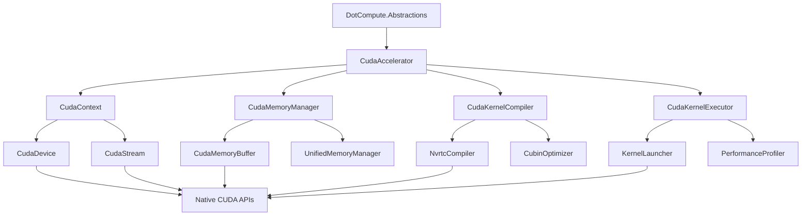

# CUDA Backend Implementation Plan for DotCompute

## Executive Summary

This document outlines a comprehensive implementation plan for a production-ready CUDA backend for the DotCompute framework. The implementation will leverage the NVIDIA RTX 2000 Ada Generation GPU (Compute Capability 8.9) and provide high-performance GPU computation capabilities.

## System Requirements

### Hardware
- **Target GPU**: NVIDIA RTX 2000 Ada Generation Laptop GPU
- **Compute Capability**: 8.9 (Ada Lovelace architecture)
- **Memory**: 8GB GDDR6
- **CUDA Support**: Full CUDA 12.x compatibility

### Software Dependencies
- CUDA Toolkit 12.x
- NVIDIA Display Driver 545+
- .NET 9.0+
- Windows/Linux cross-platform support

## Architecture Overview

### Core Components



## File Structure Design

### Primary Implementation Structure

```
plugins/backends/DotCompute.Backends.CUDA/
├── Core/
│   ├── CudaAccelerator.cs                 # Main IAccelerator implementation
│   ├── CudaBackend.cs                     # Backend entry point
│   ├── CudaBackendFactory.cs              # Factory for creating instances
│   ├── CudaBackendPlugin.cs               # Plugin registration
│   └── CudaContext.cs                     # CUDA context management
├── Device/
│   ├── CudaDevice.cs                      # Device abstraction
│   ├── CudaDeviceManager.cs               # Multi-GPU device management
│   ├── CudaCapabilities.cs                # Capability detection
│   └── CudaDeviceProperties.cs            # Extended device properties
├── Memory/
│   ├── CudaMemoryManager.cs               # Primary memory management
│   ├── CudaMemoryBuffer.cs                # GPU memory buffer
│   ├── CudaAsyncMemoryManagerAdapter.cs   # Async adapter (existing)
│   ├── UnifiedMemoryManager.cs            # CUDA unified memory
│   ├── MemoryPool.cs                      # Memory pooling for performance
│   └── P2PMemoryManager.cs                # Peer-to-peer memory transfers
├── Compilation/
│   ├── CudaKernelCompiler.cs              # NVRTC-based compilation
│   ├── CudaCompiledKernel.cs              # Compiled kernel representation
│   ├── CudaKernelCompiler.LoggerMessages.cs # Logging extensions
│   ├── NvrtcWrapper.cs                    # NVRTC API wrapper
│   ├── CubinOptimizer.cs                  # PTX to CUBIN optimization
│   └── KernelCache.cs                     # Compiled kernel caching
├── Execution/
│   ├── CudaKernelExecutor.cs              # Kernel execution engine
│   ├── CudaKernelLauncher.cs              # Kernel launch utilities
│   ├── CudaStream.cs                      # Stream management
│   ├── StreamPool.cs                      # Stream pooling
│   ├── EventManager.cs                    # CUDA event handling
│   └── PerformanceProfiler.cs             # Performance monitoring
├── Native/
│   ├── CudaRuntime.cs                     # CUDA Runtime API P/Invoke
│   ├── CudaDriver.cs                      # CUDA Driver API P/Invoke
│   ├── NvrtcRuntime.cs                    # NVRTC API P/Invoke
│   ├── CudaStructures.cs                  # Native structures
│   ├── CudaEnums.cs                       # CUDA enumerations
│   └── SafeHandles.cs                     # Safe handle implementations
├── Utils/
│   ├── CudaUtilities.cs                   # Utility functions
│   ├── ErrorHandling.cs                   # Error handling utilities
│   ├── DiagnosticTools.cs                 # Diagnostic and debugging tools
│   └── PerformanceCounters.cs             # Performance measurement
├── Tests/
│   ├── CudaBackendIntegrationTests.cs
│   ├── CudaMemoryTests.cs
│   ├── CudaKernelCompilationTests.cs
│   ├── CudaExecutionTests.cs
│   └── CudaPerformanceTests.cs
└── README.md
```

## Implementation Details

### 1. CUDA Detection & Initialization

#### CudaDevice.cs
```csharp
public sealed class CudaDevice : IDisposable
{
    public int DeviceId { get; }
    public CudaDeviceProperties Properties { get; }
    public ComputeCapability Capability { get; }
    public long TotalMemory { get; }
    public long AvailableMemory { get; }
    
    public static CudaDevice[] EnumerateDevices();
    public static CudaDevice GetBestDevice();
    public void SetAsCurrentDevice();
    public bool SupportsFeature(CudaFeature feature);
}
```

#### CudaCapabilities.cs
```csharp
public static class CudaCapabilities
{
    public static bool IsCudaSupported();
    public static Version GetCudaVersion();
    public static Version GetDriverVersion();
    public static CudaDevice[] GetAvailableDevices();
    public static bool SupportsUnifiedMemory(int deviceId);
    public static bool SupportsP2PAccess(int device1, int device2);
    public static ComputeCapability GetComputeCapability(int deviceId);
}
```

### 2. Enhanced P/Invoke Declarations

#### CudaDriver.cs (Enhanced Driver API)
```csharp
public static class CudaDriver
{
    // Context Management
    [DllImport("cuda", EntryPoint = "cuCtxCreate_v2")]
    internal static extern CudaResult cuCtxCreate(out CudaContext pctx, uint flags, int dev);
    
    [DllImport("cuda", EntryPoint = "cuCtxDestroy_v2")]
    internal static extern CudaResult cuCtxDestroy(CudaContext ctx);
    
    // Module Management with extended options
    [DllImport("cuda", EntryPoint = "cuModuleLoadDataEx")]
    internal static extern CudaResult cuModuleLoadDataEx(
        out CudaModule module, 
        IntPtr image, 
        uint numOptions, 
        CudaJitOption[] options, 
        IntPtr[] optionValues);
    
    // Kernel Execution with cooperative groups
    [DllImport("cuda", EntryPoint = "cuLaunchCooperativeKernel")]
    internal static extern CudaResult cuLaunchCooperativeKernel(
        CudaFunction f,
        uint gridDimX, uint gridDimY, uint gridDimZ,
        uint blockDimX, uint blockDimY, uint blockDimZ,
        uint sharedMemBytes,
        CudaStream hStream,
        IntPtr kernelParams);
}
```

#### NvrtcRuntime.cs (Enhanced NVRTC API)
```csharp
public static class NvrtcRuntime
{
    // Enhanced compilation with more options
    [DllImport("nvrtc64_12")]
    internal static extern NvrtcResult nvrtcCreateProgram(
        out NvrtcProgram prog,
        [MarshalAs(UnmanagedType.LPUTF8Str)] string src,
        [MarshalAs(UnmanagedType.LPUTF8Str)] string name,
        int numHeaders,
        [MarshalAs(UnmanagedType.LPArray)] string[] headers,
        [MarshalAs(UnmanagedType.LPArray)] string[] includeNames);
    
    // Get SASS (machine code) in addition to PTX
    [DllImport("nvrtc64_12")]
    internal static extern NvrtcResult nvrtcGetLTOIR(
        NvrtcProgram prog, 
        [Out] byte[] ltoir);
    
    // Compilation with link-time optimization
    [DllImport("nvrtc64_12")]
    internal static extern NvrtcResult nvrtcGetLTOIRSize(
        NvrtcProgram prog, 
        out nuint ltoir_size);
}
```

### 3. Kernel Compilation System

#### CudaKernelCompiler.cs (Enhanced)
```csharp
public sealed class CudaKernelCompiler : IKernelCompiler, IDisposable
{
    private readonly CudaContext _context;
    private readonly KernelCache _cache;
    private readonly CubinOptimizer _optimizer;
    
    // Multi-stage compilation pipeline
    public async ValueTask<ICompiledKernel> CompileAsync(
        KernelDefinition definition,
        CompilationOptions? options = null,
        CancellationToken cancellationToken = default)
    {
        // 1. Check cache first
        var cacheKey = GenerateCacheKey(definition, options);
        if (_cache.TryGetKernel(cacheKey, out var cached))
            return cached;
        
        // 2. Compile to PTX using NVRTC
        var ptxResult = await CompileToPtxAsync(definition, options, cancellationToken);
        
        // 3. Optimize and compile PTX to CUBIN
        var cubinResult = await CompileToCubinAsync(ptxResult, options, cancellationToken);
        
        // 4. Create optimized kernel
        var kernel = new CudaCompiledKernel(cubinResult);
        
        // 5. Cache for future use
        _cache.StoreKernel(cacheKey, kernel);
        
        return kernel;
    }
    
    private async Task<PtxCompilationResult> CompileToPtxAsync(
        KernelDefinition definition, 
        CompilationOptions options, 
        CancellationToken cancellationToken)
    {
        using var program = CreateNvrtcProgram(definition);
        var compilerOptions = BuildCompilerOptions(options);
        
        // Compile with NVRTC
        var result = await Task.Run(() => 
            NvrtcRuntime.nvrtcCompileProgram(program.Handle, 
                compilerOptions.Count, compilerOptions.ToArray()), 
            cancellationToken);
        
        if (result != NvrtcResult.Success)
        {
            var log = GetCompilationLog(program);
            throw new KernelCompilationException(
                $"PTX compilation failed: {NvrtcRuntime.GetErrorString(result)}", log);
        }
        
        var ptx = GetPtxCode(program);
        var metadata = ExtractKernelMetadata(program);
        
        return new PtxCompilationResult(ptx, metadata);
    }
}
```

### 4. Advanced Memory Management

#### UnifiedMemoryManager.cs
```csharp
public sealed class UnifiedMemoryManager : IMemoryManager, IDisposable
{
    private readonly CudaContext _context;
    private readonly MemoryPool _pool;
    
    public async ValueTask<IMemoryBuffer> AllocateAsync(
        long sizeInBytes,
        MemoryOptions options = MemoryOptions.None,
        CancellationToken cancellationToken = default)
    {
        // Use unified memory for seamless CPU/GPU access
        if (options.HasFlag(MemoryOptions.HostVisible))
        {
            return await AllocateUnifiedAsync(sizeInBytes, cancellationToken);
        }
        
        // Use memory pool for better performance
        if (_pool.CanSatisfy(sizeInBytes))
        {
            return _pool.Allocate(sizeInBytes, options);
        }
        
        return await AllocateDeviceAsync(sizeInBytes, options, cancellationToken);
    }
    
    private async ValueTask<CudaMemoryBuffer> AllocateUnifiedAsync(
        long sizeInBytes, 
        CancellationToken cancellationToken)
    {
        return await Task.Run(() =>
        {
            var result = CudaRuntime.cudaMallocManaged(
                out var ptr, (ulong)sizeInBytes, CudaMemAttachFlags.Global);
            
            CudaRuntime.CheckError(result, "Unified memory allocation");
            
            return new CudaMemoryBuffer(ptr, sizeInBytes, 
                MemoryOptions.HostVisible | MemoryOptions.Cached, _context);
        }, cancellationToken);
    }
}
```

### 5. Kernel Execution Engine

#### CudaKernelExecutor.cs
```csharp
public sealed class CudaKernelExecutor : IKernelExecutor, IDisposable
{
    private readonly CudaContext _context;
    private readonly StreamPool _streamPool;
    private readonly PerformanceProfiler _profiler;
    
    public async ValueTask<KernelExecutionResult> ExecuteAsync(
        CompiledKernel kernel,
        KernelArgument[] arguments,
        KernelExecutionConfig executionConfig,
        CancellationToken cancellationToken = default)
    {
        var stream = _streamPool.GetStream();
        try
        {
            // Prepare kernel arguments
            var kernelParams = PrepareKernelArguments(arguments);
            
            // Configure execution
            var launchConfig = CalculateOptimalLaunchConfig(kernel, executionConfig);
            
            // Start timing if requested
            CudaEvent? startEvent = null, endEvent = null;
            if (executionConfig.CaptureTimings)
            {
                startEvent = new CudaEvent();
                endEvent = new CudaEvent();
                startEvent.Record(stream);
            }
            
            // Launch kernel
            var result = await LaunchKernelAsync(
                kernel, kernelParams, launchConfig, stream, cancellationToken);
            
            // End timing
            if (executionConfig.CaptureTimings)
            {
                endEvent.Record(stream);
                await stream.SynchronizeAsync(cancellationToken);
                
                var timings = CalculateTimings(startEvent, endEvent);
                result.Timings = timings;
            }
            
            return result;
        }
        finally
        {
            _streamPool.ReturnStream(stream);
        }
    }
    
    public KernelExecutionConfig GetOptimalExecutionConfig(
        CompiledKernel kernel, 
        int[] problemSize)
    {
        var occupancyCalculator = new OccupancyCalculator(_context.Device);
        var optimalConfig = occupancyCalculator.CalculateOptimalConfig(
            kernel, problemSize);
        
        return new KernelExecutionConfig
        {
            GlobalWorkSize = problemSize,
            LocalWorkSize = optimalConfig.BlockSize,
            DynamicSharedMemorySize = optimalConfig.SharedMemorySize,
            Flags = DetermineOptimalFlags(kernel)
        };
    }
}
```

### 6. Error Handling & Recovery

#### ErrorHandling.cs
```csharp
public static class CudaErrorHandler
{
    public static void HandleCudaError(CudaError error, string operation)
    {
        switch (error)
        {
            case CudaError.Success:
                return;
                
            case CudaError.MemoryAllocation:
                throw new OutOfMemoryException(
                    $"CUDA out of memory during {operation}");
                    
            case CudaError.LaunchOutOfResources:
                throw new InvalidOperationException(
                    $"Insufficient resources for kernel launch during {operation}");
                    
            case CudaError.InvalidDevice:
                throw new InvalidOperationException(
                    $"Invalid CUDA device during {operation}");
                    
            default:
                throw new CudaException(
                    $"CUDA error during {operation}: {CudaRuntime.GetErrorString(error)}", 
                    error);
        }
    }
    
    public static async Task<T> RetryOnRecoverableError<T>(
        Func<Task<T>> operation, 
        int maxRetries = 3)
    {
        for (var attempt = 0; attempt < maxRetries; attempt++)
        {
            try
            {
                return await operation();
            }
            catch (CudaException ex) when (IsRecoverableError(ex.ErrorCode))
            {
                if (attempt == maxRetries - 1)
                    throw;
                    
                await Task.Delay(TimeSpan.FromMilliseconds(100 * (attempt + 1)));
                await AttemptRecovery(ex.ErrorCode);
            }
        }
        
        throw new InvalidOperationException("Unreachable code");
    }
}
```

## Performance Optimizations

### 1. Memory Pool Implementation
- Pre-allocated memory blocks to reduce allocation overhead
- Size-based pooling for common buffer sizes
- Automatic defragmentation during idle periods

### 2. Kernel Compilation Caching
- Persistent disk cache for compiled kernels
- Hash-based cache keys including source, options, and device capability
- LRU eviction policy for cache management

### 3. Stream Management
- Stream pooling to reduce creation/destruction overhead
- Automatic load balancing across streams
- Priority-based stream scheduling

### 4. Async/Await Integration
- Full async/await support for all operations
- Cancellation token support throughout the pipeline
- Background processing for non-blocking operations

## Testing Strategy

### Unit Tests
- Individual component testing with mock CUDA runtime
- Memory management correctness verification
- Compilation pipeline validation
- Error handling scenarios

### Integration Tests
- End-to-end kernel execution workflows
- Multi-GPU scenarios
- Memory transfer performance
- Stream synchronization

### Performance Tests
- Throughput benchmarking
- Memory bandwidth utilization
- Kernel launch overhead measurement
- Occupancy optimization validation

### Hardware Tests
- RTX 2000 specific capability testing
- Ada Lovelace architecture feature validation
- Compute capability 8.9 optimizations
- Power and thermal monitoring

## Implementation Milestones

### Phase 1: Core Infrastructure (Week 1)
- [ ] Enhanced P/Invoke declarations
- [ ] CUDA device detection and management
- [ ] Basic context and stream management
- [ ] Error handling framework

### Phase 2: Memory Management (Week 2)
- [ ] Advanced memory manager with pooling
- [ ] Unified memory support
- [ ] P2P memory transfers
- [ ] Memory performance optimization

### Phase 3: Kernel Compilation (Week 3)
- [ ] NVRTC integration with full options
- [ ] PTX to CUBIN optimization
- [ ] Kernel caching system
- [ ] Compilation error handling

### Phase 4: Kernel Execution (Week 4)
- [ ] Advanced kernel executor
- [ ] Performance profiling
- [ ] Occupancy optimization
- [ ] Async execution patterns

### Phase 5: Testing & Validation (Week 5)
- [ ] Comprehensive test suite
- [ ] Performance benchmarking
- [ ] RTX 2000 optimization
- [ ] Production readiness validation

## Integration Points

### DotCompute.Core Integration
- Implements `IAccelerator` interface
- Supports `IKernelCompiler` for runtime compilation
- Provides `IMemoryManager` for GPU memory operations
- Integrates with execution pipeline infrastructure

### Plugin System Integration
- Registers as `CudaBackendPlugin`
- Supports dynamic loading/unloading
- Provides capability detection
- Supports multiple backend coexistence

### LINQ Integration
- Supports expression tree compilation to CUDA kernels
- Provides optimized operators for common LINQ operations
- Integrates with query execution pipeline

## Security Considerations

- Safe P/Invoke declarations with proper marshaling
- Resource leak prevention with proper disposal patterns
- Input validation for all kernel parameters
- Sandboxed kernel execution to prevent system crashes

## Deployment Considerations

- CUDA Toolkit dependency management
- Driver version compatibility checking
- Graceful fallback when CUDA is unavailable
- NuGet package structure for easy distribution

## Future Enhancements

- CUDA Graph API integration for better performance
- Multi-process GPU sharing
- Ray tracing and tensor core utilization
- Integration with CUDA libraries (cuBLAS, cuFFT, etc.)

---

*This implementation plan provides a comprehensive roadmap for creating a production-ready CUDA backend that fully leverages the RTX 2000 Ada Generation GPU capabilities while maintaining compatibility with the broader CUDA ecosystem.*