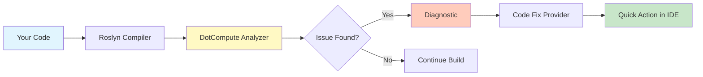

# Roslyn Analyzers and Code Fixes

> **Status**: ✅ Production Ready | **Version**: v0.5.0 | **Rules**: 12 Diagnostics, 5 Code Fixes | **Last Updated**: November 2025

DotCompute includes a comprehensive set of Roslyn analyzers and code fixes to ensure kernel code quality and catch common issues at compile time.

## 🎯 Overview

The analyzer system provides real-time feedback in Visual Studio and VS Code:

- **12 Diagnostic Rules** (DC001-DC012) for kernel quality
- **5 Automated Code Fixes** for common issues
- **IDE Integration** with IntelliSense and quick actions
- **Build-Time Validation** for continuous integration

## 🔍 Diagnostic Rules

### Performance Diagnostics

| Rule | Title | Severity | Description |
|------|-------|----------|-------------|
| **DC001** | Avoid synchronous memory transfer | Warning | Suggests async memory operations for better performance |
| **DC002** | Use memory pooling | Info | Recommends using pooled buffers to reduce allocations |
| **DC003** | Missing bounds check in kernel | Warning | Detects kernels without proper bounds validation |

### API Usage Diagnostics

| Rule | Title | Severity | Description |
|------|-------|----------|-------------|
| **DC004** | Missing [Kernel] attribute | Error | Method looks like kernel but lacks attribute |
| **DC005** | Invalid kernel signature | Error | Kernel has unsupported parameter types |
| **DC006** | Kernel should be static | Warning | Non-static kernels cannot be source-generated |

### Thread Safety Diagnostics

| Rule | Title | Severity | Description |
|------|-------|----------|-------------|
| **DC007** | Thread-unsafe operation in kernel | Warning | Detects non-thread-safe operations |
| **DC008** | Shared memory race condition | Warning | Identifies potential race conditions |

### Memory Management Diagnostics

| Rule | Title | Severity | Description |
|------|-------|----------|-------------|
| **DC009** | Missing buffer disposal | Warning | Detects missing IDisposable pattern usage |
| **DC010** | Buffer lifetime issue | Warning | Buffer accessed after disposal |

### Advanced Diagnostics

| Rule | Title | Severity | Description |
|------|-------|----------|-------------|
| **DC011** | Suboptimal backend selection | Info | Suggests better backend for workload |
| **DC012** | Inefficient memory pattern | Info | Recommends memory access optimization |

See the complete reference: [Diagnostic Rules Reference](../reference/diagnostic-rules.md)

## 🔧 Code Fixes

The analyzer provides 5 automated code fixes:

### 1. Add [Kernel] Attribute (DC004)

**Before:**
```csharp
public static void VectorAdd(ReadOnlySpan<float> a, ReadOnlySpan<float> b, Span<float> result)
{
    // ...
}
```

**After:** ✨ Quick action applies `[Kernel]` attribute
```csharp
[Kernel]
public static void VectorAdd(ReadOnlySpan<float> a, ReadOnlySpan<float> b, Span<float> result)
{
    // ...
}
```

### 2. Add Bounds Check (DC003)

**Before:**
```csharp
[Kernel]
public static void Process(Span<float> data)
{
    int idx = Kernel.ThreadId.X;
    data[idx] = data[idx] * 2; // ⚠️ Missing bounds check
}
```

**After:** ✨ Quick action adds bounds check
```csharp
[Kernel]
public static void Process(Span<float> data)
{
    int idx = Kernel.ThreadId.X;
    if (idx < data.Length) // ✅ Bounds check added
    {
        data[idx] = data[idx] * 2;
    }
}
```

### 3. Convert to Static Method (DC006)

**Before:**
```csharp
[Kernel]
public void MyKernel(Span<int> data) { } // ⚠️ Non-static
```

**After:** ✨ Quick action makes method static
```csharp
[Kernel]
public static void MyKernel(Span<int> data) { } // ✅ Static
```

### 4. Convert to Async (DC001)

**Before:**
```csharp
var buffer = accelerator.AllocateBuffer<float>(1000).Result; // ⚠️ Blocking
```

**After:** ✨ Quick action converts to async/await
```csharp
var buffer = await accelerator.AllocateBufferAsync<float>(1000); // ✅ Async
```

### 5. Use Memory Pooling (DC002)

**Before:**
```csharp
var buffer = await accelerator.AllocateBufferAsync<float>(1000); // ⚠️ Unpooled
```

**After:** ✨ Quick action uses pooled allocation
```csharp
var buffer = await accelerator.AllocatePooledBufferAsync<float>(1000); // ✅ Pooled
```

## 💡 IDE Integration

### Visual Studio

Analyzers appear in:
- **Error List** window with severity indicators
- **Quick Actions** (Ctrl+. or light bulb icon)
- **IntelliSense** with real-time diagnostics
- **Solution Explorer** with warning badges

### VS Code

Analyzers appear in:
- **Problems** panel with full diagnostic details
- **Quick Fix** menu (Ctrl+. or light bulb icon)
- **Inline diagnostics** with squiggly underlines
- **Code actions** for automated fixes

## 🏗️ Build Integration

Enable analyzers in your project file:

```xml
<PropertyGroup>
  <TreatWarningsAsErrors>true</TreatWarningsAsErrors>
  <WarningLevel>5</WarningLevel>
</PropertyGroup>

<ItemGroup>
  <PackageReference Include="DotCompute.Generators" Version="0.4.1-rc2" />
</ItemGroup>
```

### Configuring Rule Severity

Adjust severity in `.editorconfig`:

```ini
# Make DC003 an error (missing bounds check)
dotnet_diagnostic.DC003.severity = error

# Disable DC011 (backend selection suggestions)
dotnet_diagnostic.DC011.severity = none

# Set all DotCompute rules to warning
dotnet_analyzer_diagnostic.category-DotCompute.severity = warning
```

## 🔬 Architecture



The analyzer runs during:
1. **Design Time**: Real-time analysis while typing
2. **Build Time**: Full solution analysis during compilation
3. **CI/CD**: Automated validation in build pipelines

## 📊 Performance Impact

- **Analysis Time**: < 100ms per file (minimal IDE impact)
- **Memory Usage**: < 50MB for large solutions
- **Build Time**: < 2% increase with all rules enabled

## 🎓 Best Practices

1. **Enable All Rules**: Start with all diagnostics enabled
2. **Fix Critical Issues**: Address DC004-DC006 (errors) first
3. **Performance Warnings**: Review DC001-DC003 for optimization
4. **Use .editorconfig**: Standardize rules across team
5. **CI Integration**: Treat warnings as errors in CI builds

## 📖 Related Documentation

- **Diagnostic Details**: [Diagnostic Rules Reference](../reference/diagnostic-rules.md)
- **Code Generation**: [Source Generators](source-generators.md)
- **Development Guide**: [Kernel Development Guide](../guides/kernel-development.md)
- **Advanced Development**: [Analyzer Development](../advanced/analyzer-development.md)
