# Backend Implementations

> **Status**: ✅ Production Ready | **Version**: v0.4.1-rc2 | **Backends**: 4 (CPU, CUDA, Metal, OpenCL) | **Last Updated**: November 2025

DotCompute provides four production-ready compute backends, each optimized for different hardware platforms and workload characteristics.

## 🖥️ Available Backends

### CPU Backend (✅ Production Ready)

**SIMD-accelerated parallel execution** for universal compatibility:

- **Vectorization**: AVX2, AVX512 (x64), NEON (ARM)
- **Threading**: Parallel.For with work-stealing scheduler
- **Performance**: 3.7x faster than scalar code (measured)
- **Compatibility**: Works on all platforms with zero dependencies

**Key Features**:
- Hardware intrinsics for optimal performance
- Automatic SIMD lane width detection
- Thread-safe parallel execution
- Zero GPU dependency

See [CPU Backend Details](cpu.md)

### CUDA Backend (✅ Production Ready)

**NVIDIA GPU acceleration** with complete CUDA ecosystem support:

- **Compute Capability**: 5.0 - 8.9 (Maxwell to Ada Lovelace)
- **Performance**: 21-92x speedup vs CPU (measured on RTX 2000 Ada)
- **Memory**: Unified memory, P2P transfers, memory pooling
- **Features**: NVRTC compilation, PTX/CUBIN support, NCCL integration

**Key Features**:
- Dynamic compute capability detection
- On-the-fly kernel compilation with NVRTC
- Multi-GPU support with peer-to-peer transfers
- Ring kernel system for persistent GPU programs

See [CUDA Configuration](cuda-configuration.md)

### Metal Backend (✅ Production Ready)

**Apple Silicon and macOS GPU** optimization:

- **Platforms**: macOS 11+, iOS 14+
- **Hardware**: M1/M2/M3 chips, AMD GPUs on macOS
- **Performance**: Metal Performance Shaders (MPS) integration
- **Memory**: 90% pooling efficiency, binary caching

**Key Features**:
- Native Metal Shading Language (MSL) execution
- MTLBinaryArchive for shader caching
- Unified memory architecture on Apple Silicon
- MPS batch normalization and max pooling

See [Metal Backend Details](metal.md)

### OpenCL Backend (✅ Production Ready)

**Cross-platform GPU** support for heterogeneous computing:

- **Vendors**: NVIDIA, AMD, Intel, ARM Mali, Qualcomm Adreno
- **Platforms**: Windows, Linux, macOS, Android
- **Versions**: OpenCL 1.2 - 3.0
- **Features**: Device queries, buffer management, kernel compilation

**Key Features**:
- Universal compatibility across GPU vendors
- Runtime kernel compilation
- Automatic platform detection
- Fallback chain: CUDA → OpenCL → Metal → CPU

## 🎯 Backend Selection Strategy

DotCompute automatically selects the optimal backend using:

1. **Hardware Detection**: Enumerate available devices
2. **Workload Analysis**: Analyze kernel characteristics (size, complexity, memory)
3. **Performance History**: ML-powered learning from past executions
4. **Explicit Override**: User-specified backend preference

### Selection Priority

```mermaid
graph TD
    A[Start Execution] --> B{CUDA GPU<br/>Available?}
    B -->|Yes| C[Analyze Workload]
    B -->|No| D{Metal GPU<br/>Available?}

    C --> E{Workload Size<br/>> 10K elements?}
    E -->|Yes| F[✅ Use CUDA]
    E -->|No| G[❓ Check History]

    D -->|Yes| H[✅ Use Metal]
    D -->|No| I{OpenCL GPU<br/>Available?}

    I -->|Yes| J[✅ Use OpenCL]
    I -->|No| K[✅ Use CPU SIMD]

    G --> L{GPU faster<br/>historically?}
    L -->|Yes| F
    L -->|No| K

    style F fill:#4caf50
    style H fill:#4caf50
    style J fill:#4caf50
    style K fill:#4caf50
```



## 📊 Performance Characteristics

| Backend | Best For | Typical Speedup | Overhead |
|---------|----------|-----------------|----------|
| **CUDA** | Large arrays (>100K), GPU-resident workloads | 21-92x | Medium (kernel compilation) |
| **Metal** | Apple platforms, MPS operations | 15-50x | Low (binary caching) |
| **OpenCL** | Cross-platform, heterogeneous systems | 10-40x | Medium (runtime compilation) |
| **CPU** | Small arrays (<10K), universal compatibility | 3.7x (SIMD) | Minimal |

### Memory Transfer Overhead

GPU backends have memory transfer costs:
- **Small arrays** (<10K elements): CPU SIMD often faster
- **Medium arrays** (10K-100K): GPU competitive
- **Large arrays** (>100K): GPU dominant

**Optimization**: Use persistent buffers and kernel fusion to minimize transfers.

## 🔧 Backend Implementation

All backends implement the `IAccelerator` interface:

```csharp
public interface IAccelerator : IDisposable
{
    string Name { get; }
    DeviceType DeviceType { get; }

    Task<ICompiledKernel> CompileKernelAsync(KernelDefinition kernel);
    Task<IKernelResult> ExecuteKernelAsync(ICompiledKernel kernel, object[] parameters);
    Task<IUnifiedBuffer<T>> AllocateBufferAsync<T>(int length) where T : unmanaged;
}
```

### Backend Registration

Backends are automatically discovered via `IAcceleratorProvider`:

```csharp
public interface IAcceleratorProvider
{
    Task<IEnumerable<IDevice>> GetAvailableDevicesAsync();
    Task<IAccelerator> CreateAcceleratorAsync(IDevice device);
}
```

Implementations are registered in dependency injection:

```csharp
services.AddSingleton<IAcceleratorProvider, CudaAcceleratorProvider>();
services.AddSingleton<IAcceleratorProvider, MetalAcceleratorProvider>();
services.AddSingleton<IAcceleratorProvider, OpenCLAcceleratorProvider>();
services.AddSingleton<IAcceleratorProvider, CpuAcceleratorProvider>();
```

## 🎭 Backend-Specific Features

### CUDA-Specific

- **P2P Memory Transfers**: Direct GPU-to-GPU communication
- **NCCL Integration**: Multi-GPU collective operations
- **Ring Kernels**: Persistent kernels for actor systems
- **Compute Capability Detection**: Automatic architecture optimization

### Metal-Specific

- **MPS Integration**: Accelerated batch norm and max pooling
- **Binary Archives**: Precompiled shader caching
- **Unified Memory**: Zero-copy on Apple Silicon
- **Command Buffer Reuse**: Reduced API overhead

### OpenCL-Specific

- **Vendor Extensions**: NVIDIA, AMD, Intel specific optimizations
- **Sub-device Support**: Fine-grained compute unit control
- **SVM (Shared Virtual Memory)**: Pointer-based memory sharing
- **SPIR-V Support**: Portable intermediate representation

## 🔍 Backend Integration

See [Backend Integration](backend-integration.md) for detailed information on:
- Kernel compilation pipeline
- Memory management strategies
- Error handling and diagnostics
- Performance profiling and telemetry

## 📖 Related Documentation

- **Implementation Details**: [Backend Integration](backend-integration.md)
- **CPU**: [CPU Backend](cpu.md)
- **CUDA**: [CUDA Configuration](cuda-configuration.md)
- **Metal**: [Metal Backend](metal.md)
- **Selection**: [Backend Selection Guide](../guides/backend-selection.md)
- **Performance**: [Performance Characteristics](../performance/characteristics.md)
