# Core Orchestration Architecture

> **Status**: ✅ Production Ready | **Test Coverage**: 91.9% | **Last Updated**: November 2025

The Core Orchestration system is the heart of DotCompute, responsible for coordinating kernel execution across multiple backends with debugging, optimization, and telemetry capabilities.

## 🧩 System Components

```mermaid
graph TD
    A[📱 Application] --> B[🎯 IComputeOrchestrator<br/>High-level API]
    B --> C[⚙️ KernelExecutionService<br/>Orchestration]
    C --> D[📚 GeneratedKernelDiscoveryService<br/>Kernel registration]
    C --> E[🔧 IAcceleratorManager<br/>Backend selection]
    C --> F[🐛 KernelDebugService<br/>Validation - optional]
    C --> G[🤖 AdaptiveBackendSelector<br/>Optimization - optional]
    C --> H[📊 TelemetryProvider<br/>Metrics - optional]
    C --> I[🔄 RecoveryService<br/>Fault tolerance - optional]
    C --> J[💻 IAccelerator<br/>Backend execution]

    style A fill:#e1f5fe
    style B fill:#c8e6c9
    style C fill:#fff9c4
    style D fill:#f8bbd0
    style E fill:#d1c4e9
    style F fill:#ffccbc
    style G fill:#c5e1a5
    style H fill:#b3e5fc
    style I fill:#ffab91
    style J fill:#ce93d8
```



## 🎯 IComputeOrchestrator Interface

The primary interface for kernel execution:

```csharp
public interface IComputeOrchestrator
{
    /// <summary>
    /// Executes a kernel with automatic backend selection and type inference
    /// </summary>
    Task<TResult> ExecuteKernelAsync<TResult>(
        string kernelName,
        object parameters,
        CancellationToken cancellationToken = default);

    /// <summary>
    /// Executes a kernel with explicit input/output types
    /// </summary>
    Task<TOutput> ExecuteKernelAsync<TInput, TOutput>(
        string kernelName,
        TInput parameters,
        CancellationToken cancellationToken = default);
}
```

**Design Rationale**:
- **Simple API**: Hides complexity of backend selection and execution
- **Type-safe**: Generic type parameters ensure compile-time safety
- **Async-first**: Non-blocking operations for scalability
- **Cancellation**: Proper cancellation token support

## ⚙️ Kernel Execution Service

The main orchestration implementation:

### Responsibilities

1. **Kernel Discovery**
   - Discovers kernels generated by source generators
   - Maintains kernel registry with metadata
   - Supports runtime kernel registration

2. **Backend Selection**
   - Automatic selection based on workload characteristics
   - Manual override via configuration
   - Fallback to CPU for GPU failures

3. **Execution Coordination**
   - Parameter binding and validation
   - Memory allocation and transfer
   - Kernel compilation (if needed)
   - Asynchronous execution
   - Result materialization

4. **Optional Services**
   - Debug validation (cross-backend comparison)
   - Performance profiling (telemetry collection)
   - Error recovery (retry and fallback)

### 🔄 Execution Flow

```mermaid
flowchart TD
    Start([ExecuteKernelAsync called]) --> A[1️⃣ Discover kernel metadata]
    A --> B[2️⃣ Select optimal backend<br/>CPU/CUDA/Metal/OpenCL]
    B --> C[3️⃣ Allocate/get buffers<br/>from memory pool]
    C --> D[4️⃣ Bind parameters]
    D --> E{GPU backend?}
    E -->|Yes| F[5️⃣ Transfer data<br/>to device]
    E -->|No| G[5️⃣ Skip transfer<br/>zero-copy CPU]
    F --> H{Kernel<br/>cached?}
    G --> H
    H -->|No| I[6️⃣ Compile kernel]
    H -->|Yes| J[6️⃣ Use cached kernel]
    I --> K[7️⃣ Execute kernel<br/>on backend]
    J --> K
    K --> L{Debug<br/>enabled?}
    L -->|Yes| M[8️⃣ Cross-backend<br/>validation]
    L -->|No| N[8️⃣ Skip validation]
    M --> O{Telemetry<br/>enabled?}
    N --> O
    O -->|Yes| P[9️⃣ Collect metrics]
    O -->|No| Q[9️⃣ Skip metrics]
    P --> R{GPU backend?}
    Q --> R
    R -->|Yes| S[🔟 Transfer results<br/>back to host]
    R -->|No| T[🔟 Skip transfer<br/>already on host]
    S --> U[1️⃣1️⃣ Materialize results]
    T --> U
    U --> End([Return results])

    style Start fill:#c8e6c9
    style End fill:#c8e6c9
    style E fill:#fff9c4
    style H fill:#fff9c4
    style L fill:#fff9c4
    style O fill:#fff9c4
    style R fill:#fff9c4
```



### Performance Optimization

The orchestration layer is designed for minimal overhead:

**Fast Path** (typical execution):
- Kernel registry lookup: O(1) hash table lookup
- Backend selection: < 10μs (cached decision)
- Memory allocation: < 1μs (pool hit)
- Orchestration overhead: < 50μs total

**Slow Path** (first execution):
- Kernel discovery: One-time cost
- Compilation: Cached for subsequent calls
- ML model loading: One-time cost

## 📚 Kernel Discovery

### Generated Kernel Discovery

Source generators create a `GeneratedKernels` class:

```csharp
// Generated by KernelSourceGenerator
public static class GeneratedKernels
{
    public static void Register(IKernelRegistry registry)
    {
        registry.RegisterKernel(new KernelMetadata
        {
            Name = "VectorAdd",
            Namespace = "MyNamespace",
            DeclaringType = "MyClass",
            Parameters = new[]
            {
                new ParameterMetadata { Name = "a", Type = typeof(ReadOnlySpan<float>) },
                new ParameterMetadata { Name = "b", Type = typeof(ReadOnlySpan<float>) },
                new ParameterMetadata { Name = "result", Type = typeof(Span<float>) }
            },
            Backends = KernelBackends.CPU | KernelBackends.CUDA,
            IsParallel = true
        });
    }
}
```

**Discovery Process**:
1. `GeneratedKernelDiscoveryService` scans for `GeneratedKernels` classes
2. Calls `Register()` method on each
3. Builds kernel registry with O(1) lookup
4. Validates metadata consistency

### Runtime Registration

Kernels can also be registered at runtime:

```csharp
public class RuntimeKernelRegistration
{
    public void RegisterCustomKernel(IKernelRegistry registry)
    {
        registry.RegisterKernel(new KernelDefinition
        {
            Name = "CustomKernel",
            Source = "/* kernel source */",
            EntryPoint = "custom_kernel",
            Backend = AcceleratorType.CUDA
        });
    }
}
```

## 🔧 Backend Selection Strategy

### Automatic Selection

The orchestrator uses workload characteristics to select the optimal backend:

```csharp
var characteristics = new WorkloadCharacteristics
{
    DataSize = inputSize,
    ComputeIntensity = ComputeIntensity.High,
    MemoryIntensive = true,
    ParallelismPotential = ParallelismLevel.High
};

var backend = await selector.SelectBackendAsync(characteristics);
```

**Selection Criteria**:
1. **Data Size**: Small data may be faster on CPU (no transfer overhead)
2. **Compute Intensity**: Complex math benefits from GPU
3. **Memory Bandwidth**: Memory-bound operations may favor CPU with larger cache
4. **Parallelism**: Highly parallel workloads benefit from GPU

### Manual Override

Users can force specific backends:

```csharp
services.AddDotComputeRuntime(options =>
{
    options.DefaultAccelerator = AcceleratorType.CUDA;
    options.EnableAutoOptimization = false; // Disable automatic selection
});
```

### Fallback Strategy

If the selected backend fails:
1. **Retry**: Retry with exponential backoff (transient failures)
2. **Fallback to CPU**: Use CPU backend if GPU fails
3. **Exception**: Throw if CPU also fails

## 🔗 Parameter Binding

### Type-Safe Binding

The orchestrator binds parameters to kernel arguments:

```csharp
// Application code
var result = await orchestrator.ExecuteKernelAsync<float[], float[]>(
    "VectorAdd",
    new { a = dataA, b = dataB, length = 1_000_000 }
);

// Orchestrator binds:
// - float[] a → ReadOnlySpan<float> (kernel parameter)
// - float[] b → ReadOnlySpan<float> (kernel parameter)
// - int length → int (scalar parameter)
// - Allocates output buffer for result
```

**Binding Rules**:
- **Arrays**: Convert to Span<T> or ReadOnlySpan<T>
- **Scalars**: Pass by value
- **Buffers**: Use existing UnifiedBuffer<T> if provided
- **Output**: Allocate buffer based on return type

### Validation

Parameter validation occurs at multiple levels:
1. **Compile-time**: Source generators validate parameter types
2. **Orchestration**: Runtime validation of sizes and types
3. **Backend**: Device-specific validation (e.g., memory limits)

## 💾 Memory Coordination

The orchestrator coordinates with the memory manager:

### Buffer Lifecycle

```csharp
// 1. Get or allocate buffers
var bufferA = await memory.AllocateAsync<float>(size); // May come from pool
var bufferB = await memory.AllocateAsync<float>(size);
var bufferResult = await memory.AllocateAsync<float>(size);

// 2. Transfer data to device
await bufferA.CopyFromAsync(dataA);
await bufferB.CopyFromAsync(dataB);

// 3. Execute kernel
await kernel.ExecuteAsync(bufferA, bufferB, bufferResult);

// 4. Transfer results back
await bufferResult.CopyToAsync(results);

// 5. Return buffers to pool
await bufferA.DisposeAsync();
await bufferB.DisposeAsync();
await bufferResult.DisposeAsync();
```

### Memory Optimization

The orchestrator optimizes memory usage:
- **Pooling**: Reuses buffers from pool (90% allocation reduction)
- **Pipelining**: Overlaps compute and transfer
- **Pinned Memory**: Uses pinned memory for faster transfers
- **Zero-Copy**: Uses Span<T> for CPU execution

## 🔌 Integration with Optional Services

### Debug Service Integration

When debug validation is enabled:

```csharp
services.AddProductionDebugging(options =>
{
    options.EnableCrossBackendValidation = true;
    options.ValidateAllExecutions = false; // Only validate suspicious results
    options.ToleranceThreshold = 1e-5;
});
```

The orchestrator automatically:
1. Executes kernel on selected backend (e.g., GPU)
2. Executes same kernel on CPU for comparison
3. Compares results within tolerance
4. Logs discrepancies
5. Throws if validation fails in Development profile

**Overhead**: 2-5x in Development, < 5% in Production (selective validation)

### Optimization Service Integration

When ML-powered optimization is enabled:

```csharp
services.AddProductionOptimization(options =>
{
    options.OptimizationStrategy = OptimizationStrategy.Aggressive;
    options.EnableMachineLearning = true;
});
```

The orchestrator:
1. Collects execution metrics (time, data size, backend used)
2. Feeds metrics to ML model
3. ML model learns optimal backend selection
4. Future executions use learned policy

**Benefit**: 10-30% performance improvement after learning period

### Telemetry Integration

OpenTelemetry integration for observability:

```csharp
services.AddOpenTelemetry()
    .WithMetrics(metrics => metrics.AddDotComputeInstrumentation())
    .WithTracing(tracing => tracing.AddDotComputeInstrumentation());
```

Collected metrics:
- `dotcompute.kernel.executions` - Execution count
- `dotcompute.kernel.duration` - Execution duration histogram
- `dotcompute.memory.allocated` - Memory allocation count
- `dotcompute.memory.transferred` - Data transfer bandwidth

**Overhead**: < 1% with sampling

## ⚠️ Error Handling and Recovery

### Exception Hierarchy

```
ComputeException (base)
├── CompilationException (kernel compilation failed)
├── DeviceException (device/backend error)
│   ├── OutOfMemoryException
│   └── DeviceNotAvailableException
├── MemoryException (memory operation failed)
└── ExecutionException (kernel execution failed)
```

### Recovery Strategies

```csharp
try
{
    return await orchestrator.ExecuteKernelAsync(kernel, params);
}
catch (DeviceException ex) when (ex.IsTransient)
{
    // Automatic retry with exponential backoff
    await Task.Delay(100);
    return await orchestrator.ExecuteKernelAsync(kernel, params);
}
catch (DeviceException)
{
    // Fall back to CPU
    return await orchestrator.ExecuteKernelAsync(
        kernel,
        params,
        forceBackend: AcceleratorType.CPU
    );
}
```

**Automatic Recovery**:
- Transient failures: Retry 3 times with exponential backoff
- Device failures: Fallback to CPU
- Out-of-memory: Reduce batch size and retry
- Compilation errors: No automatic recovery (user fix required)

## ⚙️ Configuration Options

### Runtime Configuration

```csharp
public class DotComputeRuntimeOptions
{
    /// <summary>Default backend for execution (Auto, CPU, CUDA, Metal, OpenCL)</summary>
    public AcceleratorType DefaultAccelerator { get; set; } = AcceleratorType.Auto;

    /// <summary>Enable telemetry collection</summary>
    public bool EnableTelemetry { get; set; } = true;

    /// <summary>Enable cross-backend debug validation</summary>
    public bool EnableDebugValidation { get; set; } = false;

    /// <summary>Enable ML-powered backend optimization</summary>
    public bool EnableAutoOptimization { get; set; } = true;

    /// <summary>Enable automatic error recovery</summary>
    public bool EnableRecovery { get; set; } = true;

    /// <summary>Minimum log level</summary>
    public LogLevel MinimumLogLevel { get; set; } = LogLevel.Information;
}
```

### Service Registration

```csharp
// Minimal setup
services.AddDotComputeRuntime();

// With configuration
services.AddDotComputeRuntime(options =>
{
    options.DefaultAccelerator = AcceleratorType.CUDA;
    options.EnableDebugValidation = true;
});

// Complete setup with all features
services.AddDotComputeComplete(configuration);
```

## ⚡ Performance Characteristics

### Orchestration Overhead

| Operation | Time | Notes |
|-----------|------|-------|
| Kernel lookup | < 1μs | Hash table O(1) |
| Backend selection | < 10μs | Cached decisions |
| Parameter binding | < 20μs | Type conversion |
| Memory allocation | < 1μs | Pool hit |
| Total overhead | < 50μs | Typical execution |

### Scalability

- **Concurrent executions**: Unlimited (backend-limited)
- **Registered kernels**: Millions (O(1) lookup)
- **Active buffers**: Millions (with pooling)
- **Throughput**: 20K+ kernel executions/second

## 🧪 Testing Strategy

### Unit Testing

```csharp
[Fact]
public async Task ExecuteKernelAsync_ValidKernel_ReturnsCorrectResult()
{
    // Arrange
    var orchestrator = CreateOrchestrator();
    var input = Enumerable.Range(0, 1000).Select(i => (float)i).ToArray();

    // Act
    var result = await orchestrator.ExecuteKernelAsync<float[], float[]>(
        "VectorDouble",
        new { input }
    );

    // Assert
    result.Should().BeEquivalentTo(input.Select(x => x * 2));
}
```

### Integration Testing

```csharp
[Fact]
public async Task ExecuteKernelAsync_WithDebugValidation_ValidatesResults()
{
    // Arrange
    var services = CreateServicesWithDebugging();
    var orchestrator = services.GetRequiredService<IComputeOrchestrator>();

    // Act & Assert - should not throw
    await orchestrator.ExecuteKernelAsync("SimpleKernel", params);
}
```

## Related Documentation

- [Architecture Overview](overview.md)
- [Backend Integration](backend-integration.md)
- [Memory Management](memory-management.md)
- [Debugging System](debugging-system.md)
- [Optimization Engine](optimization-engine.md)
