# Architecture Overview

> **Status**: ✅ Production Ready | **Version**: v0.5.0 | **Last Updated**: November 2025

DotCompute follows a layered architecture designed for extensibility, performance, and maintainability. This document provides a high-level overview of the system's design and key architectural decisions.

## 🏗️ System Layers

```mermaid
graph TB
    A[📱 Application Layer<br/>Kernel attributes & IComputeOrchestrator]
    B[⚙️ Source Generators & Analyzers<br/>Compile-time code generation & validation]
    C[🎯 Core Runtime & Orchestration<br/>Execution, debugging, optimization, telemetry]
    D[🔧 Backend Implementations<br/>CPU, CUDA, Metal, OpenCL]
    E[💾 Memory Management<br/>Unified buffers, pooling, transfers, P2P]

    A --> B
    B --> C
    C --> D
    D --> E

    style A fill:#e1f5fe
    style B fill:#fff9c4
    style C fill:#c8e6c9
    style D fill:#ffccbc
    style E fill:#f8bbd0
```



## 🎯 Core Architectural Principles

### 1. 🔀 **Separation of Concerns**
Each layer has distinct responsibilities:
- **Application**: Business logic and kernel definitions
- **Generators**: Compile-time code generation and validation
- **Core Runtime**: Execution orchestration and cross-cutting concerns
- **Backends**: Device-specific implementations
- **Memory**: Unified memory abstraction

### 2. 🔌 **Backend Independence**
The application layer is isolated from backend specifics through:
- `IAccelerator` interface for all backends
- `IComputeOrchestrator` for unified kernel execution
- `IUnifiedMemoryManager` for memory operations
- Automatic backend selection based on workload characteristics

### 3. ⚡ **Performance by Design**
Performance is baked into the architecture:
- **Compile-time code generation**: Zero-overhead abstractions
- **Memory pooling**: 90% reduction in allocations
- **Native AOT support**: Sub-10ms startup times
- **Async-first**: Non-blocking operations throughout

### 4. 🔧 **Extensibility**
The system is designed for extension:
- **Plugin architecture**: Hot-reload capable backend plugins
- **Source generators**: Custom code generation pipelines
- **Analyzers**: Custom validation rules
- **Optimization strategies**: Pluggable optimization algorithms

### 5. 📊 **Observability**
Built-in observability from the ground up:
- **OpenTelemetry integration**: Distributed tracing and metrics
- **Debug services**: Cross-backend validation
- **Telemetry providers**: Performance profiling
- **Health monitoring**: Plugin and service health checks

## 🧩 Key Components

### 📱 Application Layer

**Purpose**: Define compute kernels and orchestrate execution

**Key Types**:
- `[Kernel]` attribute: Marks methods for GPU acceleration
- `IComputeOrchestrator`: High-level execution interface
- `KernelDefinition`: Metadata for kernel methods

**Responsibilities**:
- Kernel declaration with attributes
- Service configuration and DI setup
- Result materialization and processing

### ⚙️ Source Generator Layer

**Purpose**: Compile-time code generation and validation

**Key Components**:
- `KernelSourceGenerator`: Generates backend-specific implementations
- `KernelMethodAnalyzer`: Validates kernel code (DC001-DC012)
- `KernelCodeFixProvider`: Automated IDE fixes

**Responsibilities**:
- Backend code generation (CPU SIMD, CUDA, Metal, OpenCL)
- Kernel registry generation for runtime discovery
- Compile-time validation and diagnostics
- Performance hint injection

### 🎯 Core Runtime Layer

**Purpose**: Orchestration, debugging, optimization, and telemetry

**Key Components**:
- `KernelExecutionService`: Coordinates kernel execution
- `KernelDebugService`: Cross-backend validation
- `AdaptiveBackendSelector`: ML-powered backend selection
- `TelemetryProvider`: OpenTelemetry integration
- `AcceleratorManager`: Backend lifecycle management

**Responsibilities**:
- Kernel discovery and registration
- Execution orchestration across backends
- Cross-backend debugging and validation
- Performance profiling and metrics collection
- Fault tolerance and error recovery

### 🔧 Backend Layer

**Purpose**: Device-specific compute implementations

**Implementations**:
- **CPU Backend**: SIMD vectorization (AVX512/AVX2/NEON)
- **CUDA Backend**: NVIDIA GPU support (CC 5.0+)
- **Metal Backend**: Apple Silicon optimization
- **OpenCL Backend**: Cross-platform GPU support

**Common Interface** (`IAccelerator`):
- `CompileKernelAsync()` - Compile kernel for specific backend
- `AllocateAsync()` - Allocate device memory
- `SynchronizeAsync()` - Wait for completion
- `DisposeAsync()` - Clean up resources

### 💾 Memory Management Layer

**Purpose**: Unified memory abstraction with performance optimization

**Key Components**:
- `UnifiedMemoryManager`: Central memory authority
- `OptimizedUnifiedBuffer<T>`: Performance-optimized buffers
- `MemoryPool`: Buffer pooling with 21 size classes
- `AdvancedMemoryTransferEngine`: Concurrent transfer orchestration

**Responsibilities**:
- Cross-device memory allocation
- Host-device data transfers
- Memory pooling and reuse
- Zero-copy operations via Span<T>
- P2P transfers between GPUs

## 🔄 Data Flow

### Kernel Execution Flow

```mermaid
sequenceDiagram
    participant App as 📱 Application
    participant Gen as ⚙️ Source Generator
    participant Orch as 🎯 Orchestrator
    participant Sel as 🤖 Backend Selector
    participant Mem as 💾 Memory Manager
    participant Back as 🔧 Backend (GPU/CPU)
    participant Debug as 🐛 Debug Service
    participant Tel as 📊 Telemetry

    App->>Gen: 1. Define [Kernel] method
    Gen->>Orch: 2. Generate implementations
    Orch->>Orch: 3. Discover & register kernels
    App->>Orch: 4. ExecuteKernelAsync()
    Orch->>Sel: 5. Select optimal backend
    Sel-->>Orch: CUDA/CPU/Metal/OpenCL
    Orch->>Mem: 6. Allocate/transfer buffers
    Mem-->>Orch: UnifiedBuffer ready
    Orch->>Back: 7. Compile & execute kernel
    Back-->>Orch: Execution complete
    Orch->>Debug: 8. Validate results (optional)
    Debug-->>Orch: Validation passed
    Orch->>Tel: 9. Record metrics
    Orch->>Mem: 10. Transfer results back
    Orch-->>App: Return results
```



### Memory Transfer Flow

```
1. Application requests buffer allocation
        ↓
2. Memory manager checks pool for available buffer
        ↓
3. If available: return pooled buffer (fast path)
   If not: allocate new buffer
        ↓
4. Application writes data to buffer
        ↓
5. Buffer transfers to device (async, pipelined)
        ↓
6. Kernel executes on device buffer
        ↓
7. Results transfer back to host
        ↓
8. Application reads results
        ↓
9. Buffer returned to pool for reuse
```

## Design Patterns

### Factory Pattern
Used for backend creation:
- `IAcceleratorFactory` - Create accelerators based on configuration
- `IUnifiedAcceleratorFactory` - Workload-aware accelerator selection

### Strategy Pattern
Used for optimization and backend selection:
- `IOptimizationStrategy` - Different optimization approaches
- `IBackendSelectionStrategy` - Backend selection algorithms

### Observer Pattern
Used for telemetry and monitoring:
- `ITelemetryProvider` - Telemetry event publishing
- `IKernelExecutionMonitor` - Execution monitoring

### Plugin Pattern
Used for extensibility:
- `IBackendPlugin` - Backend plugin interface
- `PluginLoader` - Dynamic plugin loading with isolation

### Dependency Injection
Used throughout for loose coupling:
- Microsoft.Extensions.DependencyInjection integration
- Service lifetimes (Singleton, Scoped, Transient)
- Configuration via IOptions<T>

## Cross-Cutting Concerns

### Error Handling
Comprehensive error handling strategy:
- **Compile-time**: Analyzer diagnostics (DC001-DC012)
- **Runtime**: Typed exceptions (ComputeException, CompilationException)
- **Recovery**: Automatic retry with exponential backoff
- **Fallback**: CPU fallback for GPU failures

### Logging
Structured logging throughout:
- Microsoft.Extensions.Logging integration
- Contextual logging with scope
- Minimum overhead in production
- Trace-level for development debugging

### Configuration
Flexible configuration system:
- IConfiguration integration
- IOptions<T> pattern
- Validation via IValidateOptions<T>
- Environment-specific overrides

### Thread Safety
Explicit thread safety guarantees:
- **Thread-safe**: Memory management, pooling, caches
- **Single-threaded**: Individual kernel executions
- **Documentation**: Thread safety documented per type

## Performance Characteristics

### Overhead Analysis

| Component | Overhead | Optimization |
|-----------|----------|--------------|
| Orchestration | < 50μs | Direct method calls, no reflection |
| Memory pooling | < 1μs | Lock-free concurrent structures |
| Telemetry | < 1% | Sampling and async collection |
| Debugging (Dev) | 2-5x | Extensive validation |
| Debugging (Prod) | < 5% | Targeted checks only |
| Backend selection | < 10μs | Cached decisions, ML inference |

### Scalability

- **Concurrent kernels**: Unlimited (backend-limited)
- **Memory buffers**: Millions with pooling
- **Plugin count**: Hundreds
- **Pipeline depth**: No practical limit

## Technology Stack

### Build-Time
- **Roslyn**: Source generators and analyzers
- **C# 13**: Latest language features
- **.NET 9.0**: Target framework
- **MSBuild**: Build integration

### Runtime
- **Microsoft.Extensions.*** Integration with .NET ecosystem
- **OpenTelemetry**: Observability infrastructure
- **System.Numerics.Vectors**: SIMD support
- **System.Memory**: Span<T> and Memory<T>

### Testing
- **xUnit**: Unit testing framework
- **BenchmarkDotNet**: Performance benchmarking
- **Moq**: Mocking framework
- **FluentAssertions**: Assertion library

## Native AOT Compatibility

DotCompute is fully compatible with Native AOT:

**What Works**:
- All core runtime functionality
- All backend implementations
- Memory management
- Source generators
- Telemetry and monitoring

**Requirements**:
- No runtime code generation
- No reflection in hot paths
- Trimming-safe attribute usage
- AOT-analyzer verified

**Benefits**:
- Sub-10ms startup times
- Smaller deployment size
- Better performance
- Reduced memory usage

## Security Considerations

### Plugin Sandboxing
- Isolated AssemblyLoadContexts
- Permission management
- Resource limits (CPU, memory)
- Signature validation

### Input Validation
- Compile-time parameter validation
- Runtime bounds checking
- Type safety enforcement
- Resource limit enforcement

### Vulnerability Management
- NuGet package scanning
- CVE database integration
- GitHub advisory monitoring
- Automated security updates

## Future Enhancements

### Completed in v0.5.0
- ✅ Ring Kernel System (Phases 1-5 complete)
- ✅ Multi-GPU coordination with Cross-GPU Barriers
- ✅ Temporal causality tracking (Hybrid Logical Clock)
- ✅ Hierarchical Task Queues with priority scheduling
- ✅ CUDA backend with 21-92x speedup
- ✅ CPU SIMD backend with 3.7x speedup
- ✅ Metal and OpenCL backends (experimental)

### Near-term (v0.6.0)
- Complete LINQ extensions (Join/GroupBy/OrderBy)
- Enhanced Metal C# to MSL translation
- Production testing for Metal/OpenCL backends
- Performance profiling tools

### Medium-term (v0.7.0-v0.8.0)
- ROCm backend for AMD GPUs
- DirectX Compute backend
- Advanced kernel fusion
- Auto-tuning with persistent learning

### Long-term (v1.0.0)
- Distributed computing support
- Cloud provider integration (Azure, AWS, GCP)
- Visual debugging tools
- Full production certification for all backends

## Related Documentation

- [Core Orchestration](core-orchestration.md) - Detailed orchestration design
- [Backend Integration](backend-integration.md) - Backend plugin architecture
- [Memory Management](memory-management.md) - Memory system design
- [Debugging System](debugging-system.md) - Cross-backend validation
- [Optimization Engine](optimization-engine.md) - Adaptive backend selection
- [Source Generators](source-generators.md) - Code generation pipeline
