# Runtime Architecture

> **Status**: ✅ Production Ready | **Version**: v0.6.2 | **Test Coverage**: 91.9% | **Last Updated**: November 2025

The DotCompute runtime provides comprehensive service orchestration, dependency injection, and plugin management for seamless integration with .NET applications.

## 🎯 Overview

The runtime layer bridges application code with compute backends through:

- **Service Discovery**: Automatic kernel and backend registration
- **Dependency Injection**: Microsoft.Extensions.DependencyInjection integration
- **Lifecycle Management**: Service activation and disposal
- **Plugin System**: Hot-reloadable extensions and custom backends

## ⚙️ Service Orchestration

The `IComputeOrchestrator` interface provides unified kernel execution across all backends:

```csharp
public interface IComputeOrchestrator
{
    Task<IKernelResult> ExecuteKernelAsync(
        string kernelName,
        object[] parameters,
        CancellationToken cancellationToken = default);

    Task<IEnumerable<IDevice>> GetAvailableDevicesAsync();
    IKernel GetKernel(string kernelName);
}
```

### Key Components

- **KernelExecutionService**: Orchestrates kernel compilation and execution
- **GeneratedKernelDiscoveryService**: Automatically discovers [Kernel] attributed methods
- **UnifiedAcceleratorFactory**: Creates and manages backend instances

See [Core Orchestration](core-orchestration.md) for detailed execution flow.

## 🔌 Dependency Injection Integration

DotCompute uses `Microsoft.Extensions.DependencyInjection` for service configuration:

```csharp
using DotCompute.Runtime;
using Microsoft.Extensions.DependencyInjection;

var services = new ServiceCollection();

// Register core runtime services
services.AddDotComputeRuntime();

// Optional: Add performance monitoring
services.AddPerformanceMonitoring();

// Optional: Add advanced memory management
services.AddAdvancedMemoryManagement();

var provider = services.BuildServiceProvider();
var orchestrator = provider.GetRequiredService<IComputeOrchestrator>();
```

### Service Lifetimes

| Service | Lifetime | Description |
|---------|----------|-------------|
| `IComputeOrchestrator` | Singleton | Main entry point for kernel execution |
| `IUnifiedAcceleratorFactory` | Singleton | Backend creation and device enumeration |
| `IKernelDebugService` | Singleton | Cross-backend validation and profiling |
| `IAdaptiveBackendSelector` | Singleton | ML-powered backend selection |
| Backend implementations | Singleton | Reused across kernel executions |

See the [Dependency Injection Guide](../guides/dependency-injection.md) for advanced scenarios.

## 🧩 Plugin System

DotCompute supports extensibility through plugins:

- **Custom Backends**: Implement `IAccelerator` for new compute platforms
- **Optimization Strategies**: Add custom backend selectors
- **Memory Managers**: Provide specialized memory pooling
- **Telemetry Providers**: Integrate with monitoring systems

### Plugin Registration

```csharp
services.AddDotComputeRuntime(options =>
{
    options.RegisterPlugin<MyCustomBackend>();
    options.EnableHotReload = true;
});
```

For plugin development, see the [Plugin Development Guide](../guides/plugin-development.md).

## 📊 Service Discovery

The runtime automatically discovers:

1. **Kernels**: Methods with `[Kernel]` attribute via source generation
2. **Backends**: Implementations of `IAcceleratorProvider` interface
3. **Optimization Plugins**: Classes implementing `IBackendSelector`

This enables zero-configuration setup for most scenarios.

## 🔄 Execution Pipeline

```mermaid
graph LR
    A[Application Code] --> B[IComputeOrchestrator]
    B --> C[Kernel Discovery]
    C --> D[Backend Selection]
    D --> E[Memory Allocation]
    E --> F[Kernel Compilation]
    F --> G[Execution]
    G --> H[Result Materialization]

    style A fill:#e1f5fe
    style B fill:#c8e6c9
    style D fill:#fff9c4
    style G fill:#ffccbc
    style H fill:#f8bbd0
```



## 🎯 Key Features

### Automatic Service Registration

All DotCompute services are registered with a single call:

```csharp
services.AddDotComputeRuntime();
```

This registers:
- ✅ Core orchestration services
- ✅ All available backend providers (CPU, CUDA, Metal, OpenCL)
- ✅ Memory management services
- ✅ Kernel discovery and compilation

### Backend-Agnostic API

Write code once, execute anywhere:

```csharp
// Works on CPU, CUDA, Metal, or OpenCL automatically
var result = await orchestrator.ExecuteKernelAsync("VectorAdd", new object[] { a, b, output });
```

### Native AOT Compatible

The runtime supports Native AOT compilation:
- No runtime code generation (uses source generators)
- Minimal reflection (only for service registration)
- Sub-10ms startup times

## 📖 Related Documentation

- **Core Concepts**: [Core Orchestration](core-orchestration.md)
- **Development**: [Plugin Development](../guides/plugin-development.md)
- **Configuration**: [Dependency Injection Guide](../guides/dependency-injection.md)
- **Debugging**: [Debugging System](debugging-system.md)
- **Optimization**: [Optimization Engine](optimization-engine.md)
