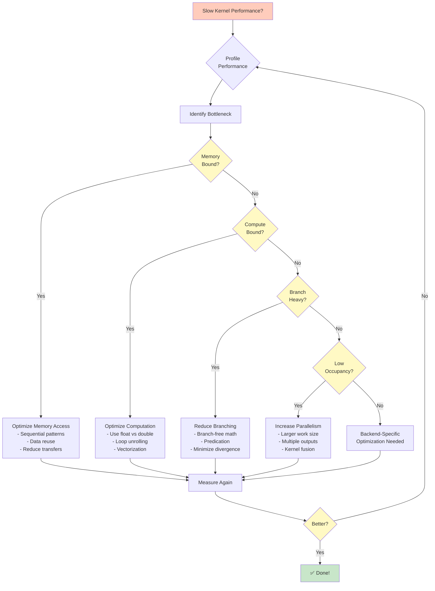

# Kernel Development Guide

> **Status**: ✅ Production Ready | **Test Coverage**: 100% | **Last Updated**: November 2025

This guide covers best practices for writing efficient, correct, and maintainable compute kernels with DotCompute.

## 📚 Kernel Development Workflow

```mermaid
flowchart LR
    A[1️⃣ Define Kernel<br/>with [Kernel] attribute] --> B[2️⃣ Write Logic<br/>with bounds checking]
    B --> C[3️⃣ Build Project<br/>source generator runs]
    C --> D{Analyzer<br/>Warnings?}
    D -->|Yes| E[🔧 Fix Issues<br/>DC001-DC012]
    D -->|No| F[4️⃣ Write Tests<br/>unit & integration]
    E --> B
    F --> G[5️⃣ Run Tests<br/>all backends]
    G --> H{Tests<br/>Pass?}
    H -->|No| I[🐛 Debug<br/>cross-backend validation]
    H -->|Yes| J[6️⃣ Profile<br/>performance]
    I --> B
    J --> K{Performance<br/>Acceptable?}
    K -->|No| L[⚡ Optimize<br/>memory access & branching]
    K -->|Yes| M[✅ Deploy<br/>production ready!]
    L --> B

    style A fill:#c8e6c9
    style M fill:#c8e6c9
    style D fill:#fff9c4
    style H fill:#fff9c4
    style K fill:#fff9c4
    style E fill:#ffccbc
    style I fill:#ffccbc
    style L fill:#ffccbc
```

## 📖 Kernel Basics

### 🔍 Anatomy of a Kernel

```csharp
[Kernel]                                    // 1. Kernel attribute
public static void MyKernel(                // 2. Must be static, return void
    ReadOnlySpan<float> input,              // 3. Input parameters (ReadOnlySpan)
    Span<float> output,                     // 4. Output parameters (Span)
    int length)                             // 5. Scalar parameters
{
    int idx = Kernel.ThreadId.X;            // 6. Thread indexing

    if (idx < length)                       // 7. Bounds checking
    {
        output[idx] = input[idx] * 2.0f;    // 8. Kernel logic
    }
}
```

### Kernel Requirements

**Must Have**:
- `[Kernel]` attribute
- `static` modifier
- `void` return type
- At least one parameter
- Bounds checking
- `Kernel.ThreadId` for indexing

**Cannot Have**:
- `async` modifier
- Instance methods
- `ref`/`out` parameters (except `Span<T>`)
- LINQ expressions
- Reflection
- Non-inlineable method calls

## 🧵 Thread Indexing

### 1D Indexing (Most Common)

```csharp
[Kernel]
public static void Process1D(ReadOnlySpan<float> input, Span<float> output)
{
    int idx = Kernel.ThreadId.X;

    if (idx < output.Length)
    {
        output[idx] = input[idx] * 2;
    }
}
```

**Use Cases**: Vector operations, element-wise operations, 1D arrays

### 2D Indexing

```csharp
[Kernel]
public static void Process2D(
    ReadOnlySpan<float> input,
    Span<float> output,
    int width,
    int height)
{
    int col = Kernel.ThreadId.X;
    int row = Kernel.ThreadId.Y;

    if (col < width && row < height)
    {
        int idx = row * width + col;
        output[idx] = input[idx] * 2;
    }
}
```

**Use Cases**: Image processing, matrix operations, 2D grids

### 3D Indexing

```csharp
[Kernel]
public static void Process3D(
    ReadOnlySpan<float> input,
    Span<float> output,
    int width,
    int height,
    int depth)
{
    int x = Kernel.ThreadId.X;
    int y = Kernel.ThreadId.Y;
    int z = Kernel.ThreadId.Z;

    if (x < width && y < height && z < depth)
    {
        int idx = z * (width * height) + y * width + x;
        output[idx] = input[idx] * 2;
    }
}
```

**Use Cases**: Volumetric data, 3D simulations, video processing

## 📝 Parameter Types

### Input Parameters: ReadOnlySpan<T>

```csharp
[Kernel]
public static void Example(
    ReadOnlySpan<float> input,    // ✅ Recommended
    ReadOnlySpan<int> indices,    // ✅ Multiple inputs OK
    Span<float> output)
{
    int idx = Kernel.ThreadId.X;
    if (idx < output.Length)
    {
        output[idx] = input[indices[idx]];
    }
}
```

**Benefits**:
- Compiler enforces read-only semantics
- Zero-copy on CPU
- Clear intent in API

### Output Parameters: Span<T>

```csharp
[Kernel]
public static void Example(
    ReadOnlySpan<float> input,
    Span<float> output1,          // ✅ Multiple outputs OK
    Span<float> output2)
{
    int idx = Kernel.ThreadId.X;
    if (idx < input.Length)
    {
        output1[idx] = input[idx] * 2;
        output2[idx] = input[idx] + 1;
    }
}
```

**Benefits**:
- Clear output semantics
- Allows multiple outputs
- Efficient memory access

### Scalar Parameters

```csharp
[Kernel]
public static void Scale(
    ReadOnlySpan<float> input,
    Span<float> output,
    float scaleFactor,           // ✅ Scalar parameter
    int offset)                  // ✅ Multiple scalars OK
{
    int idx = Kernel.ThreadId.X;
    if (idx < output.Length)
    {
        output[idx] = input[idx] * scaleFactor + offset;
    }
}
```

**Supported Scalar Types**:
- `int`, `long`, `short`, `byte`
- `float`, `double`
- `bool`
- `uint`, `ulong`, `ushort`, `sbyte`

## 🛡️ Bounds Checking

### Why Bounds Checking Matters

```csharp
// ❌ BAD: No bounds check (crashes on out-of-bounds)
[Kernel]
public static void Unsafe(ReadOnlySpan<float> input, Span<float> output)
{
    int idx = Kernel.ThreadId.X;
    output[idx] = input[idx] * 2; // May access beyond array bounds!
}

// ✅ GOOD: Always check bounds
[Kernel]
public static void Safe(ReadOnlySpan<float> input, Span<float> output)
{
    int idx = Kernel.ThreadId.X;
    if (idx < output.Length)  // Prevents out-of-bounds access
    {
        output[idx] = input[idx] * 2;
    }
}
```

**Analyzer Warning**: DC009 will warn about missing bounds checks

### Bounds Checking Patterns

**Pattern 1: Single Array**
```csharp
if (idx < array.Length)
{
    array[idx] = value;
}
```

**Pattern 2: Multiple Arrays (Same Size)**
```csharp
if (idx < Math.Min(input.Length, output.Length))
{
    output[idx] = input[idx] * 2;
}
```

**Pattern 3: 2D Bounds**
```csharp
if (col < width && row < height)
{
    int idx = row * width + col;
    array[idx] = value;
}
```

**Pattern 4: Early Return**
```csharp
int idx = Kernel.ThreadId.X;
if (idx >= array.Length)
    return;  // Thread does nothing if out of bounds

array[idx] = value;
```

## 🎯 Common Kernel Patterns

### 1. Vector Addition

```csharp
[Kernel]
public static void VectorAdd(
    ReadOnlySpan<float> a,
    ReadOnlySpan<float> b,
    Span<float> result)
{
    int idx = Kernel.ThreadId.X;
    if (idx < result.Length)
    {
        result[idx] = a[idx] + b[idx];
    }
}
```

**Performance**: Memory-bound, ~12 GB/s on PCIe 4.0

### 2. Scalar Multiply

```csharp
[Kernel]
public static void ScalarMultiply(
    ReadOnlySpan<float> input,
    Span<float> output,
    float scalar)
{
    int idx = Kernel.ThreadId.X;
    if (idx < output.Length)
    {
        output[idx] = input[idx] * scalar;
    }
}
```

**Performance**: Memory-bound, same as vector add

### 3. Dot Product (Reduction)

```csharp
[Kernel]
public static void DotProduct(
    ReadOnlySpan<float> a,
    ReadOnlySpan<float> b,
    Span<float> partialSums,  // One per thread block
    int n)
{
    int idx = Kernel.ThreadId.X;

    // Each thread computes partial sum
    float sum = 0;
    for (int i = idx; i < n; i += Kernel.GridDim.X * Kernel.BlockDim.X)
    {
        sum += a[i] * b[i];
    }

    // Store partial sum (final reduction happens on CPU)
    int blockIdx = Kernel.BlockId.X;
    partialSums[blockIdx] = sum;
}
```

**Note**: Full parallel reduction requires additional synchronization not shown here

### 4. Matrix Multiplication

```csharp
[Kernel]
public static void MatrixMultiply(
    ReadOnlySpan<float> a,
    ReadOnlySpan<float> b,
    Span<float> c,
    int M, int N, int K)  // A: M×K, B: K×N, C: M×N
{
    int row = Kernel.ThreadId.Y;
    int col = Kernel.ThreadId.X;

    if (row < M && col < N)
    {
        float sum = 0;
        for (int k = 0; k < K; k++)
        {
            sum += a[row * K + k] * b[k * N + col];
        }
        c[row * N + col] = sum;
    }
}
```

**Performance**: Compute-bound, benefits greatly from GPU

### 5. Image Blur (Convolution)

```csharp
[Kernel]
public static void GaussianBlur(
    ReadOnlySpan<float> input,
    Span<float> output,
    int width,
    int height)
{
    int x = Kernel.ThreadId.X;
    int y = Kernel.ThreadId.Y;

    if (x >= 1 && x < width - 1 && y >= 1 && y < height - 1)
    {
        // 3x3 Gaussian kernel
        float sum = 0;
        sum += input[(y-1) * width + (x-1)] * 0.0625f;
        sum += input[(y-1) * width +  x   ] * 0.125f;
        sum += input[(y-1) * width + (x+1)] * 0.0625f;
        sum += input[ y    * width + (x-1)] * 0.125f;
        sum += input[ y    * width +  x   ] * 0.25f;
        sum += input[ y    * width + (x+1)] * 0.125f;
        sum += input[(y+1) * width + (x-1)] * 0.0625f;
        sum += input[(y+1) * width +  x   ] * 0.125f;
        sum += input[(y+1) * width + (x+1)] * 0.0625f;

        output[y * width + x] = sum;
    }
}
```

**Performance**: Memory-bound with spatial locality

## 🔒 Thread Synchronization and Barriers

### What Are Barriers?

Barriers are synchronization points where threads wait until all threads in a scope (warp, thread block, or grid) reach the barrier before any proceed. This ensures coordinated memory access and prevents race conditions.

```csharp
[Kernel(UseBarriers = true, BarrierScope = BarrierScope.ThreadBlock)]
public static void WithBarrier(Span<float> data)
{
    int tid = Kernel.ThreadId.X;

    // Phase 1: All threads write
    data[tid] = ComputeValue(tid);

    Kernel.Barrier();  // ⏸️ Wait for all threads

    // Phase 2: All threads read (guaranteed to see all writes)
    float neighbor = data[(tid + 1) % Kernel.BlockDim.X];
    data[tid] = (data[tid] + neighbor) / 2.0f;
}
```

### When to Use Barriers

**Use Barriers When**:
- Coordinating shared memory access across threads
- Implementing reduction operations
- Multi-phase algorithms with dependencies
- Stencil computations requiring neighbor communication

**Don't Use Barriers When**:
- Threads operate completely independently
- No inter-thread communication needed
- Only using global memory without dependencies

### Barrier Scopes

#### ThreadBlock Scope (Most Common)

Synchronizes all threads within a thread block.

```csharp
[Kernel(
    UseBarriers = true,
    BarrierScope = BarrierScope.ThreadBlock,
    BlockDimensions = new[] { 256 })]
public static void ThreadBlockBarrier(
    ReadOnlySpan<float> input,
    Span<float> output)
{
    // Allocate shared memory for the thread block
    var shared = Kernel.AllocateShared<float>(256);

    int tid = Kernel.ThreadId.X;
    int bid = Kernel.BlockId.X;
    int gid = bid * 256 + tid;

    // Phase 1: Load data into shared memory
    if (gid < input.Length)
        shared[tid] = input[gid];

    Kernel.Barrier();  // ✅ All threads see loaded data

    // Phase 2: Access neighbor data safely
    if (tid > 0 && tid < 255)
    {
        float avg = (shared[tid - 1] + shared[tid] + shared[tid + 1]) / 3.0f;
        output[gid] = avg;
    }
}
```

**Latency**: ~10-20ns
**Supported**: All backends (CUDA, Metal, OpenCL, CPU)

#### Warp Scope (Fine-Grained)

Synchronizes threads within a single warp (32 threads on NVIDIA, 32-64 on other vendors).

```csharp
[Kernel(
    UseBarriers = true,
    BarrierScope = BarrierScope.Warp,
    Backends = KernelBackends.CUDA | KernelBackends.Metal)]
public static void WarpBarrier(Span<int> data)
{
    int tid = Kernel.ThreadId.X;
    int laneId = tid % 32;

    // Warp-level reduction
    int value = data[tid];

    Kernel.Barrier();  // Sync within warp

    // Butterfly reduction (warp-level)
    if (laneId < 16) value += data[tid + 16];
    Kernel.Barrier();

    if (laneId < 8) value += data[tid + 8];
    Kernel.Barrier();

    if (laneId < 4) value += data[tid + 4];
    Kernel.Barrier();

    if (laneId < 2) value += data[tid + 2];
    Kernel.Barrier();

    if (laneId < 1) value += data[tid + 1];

    if (laneId == 0)
        data[tid / 32] = value;  // Store warp sum
}
```

**Latency**: ~1-5ns
**Supported**: CUDA, Metal

#### Grid Scope (CUDA Only)

Synchronizes ALL threads across ALL thread blocks (requires cooperative launch).

```csharp
[Kernel(
    UseBarriers = true,
    BarrierScope = BarrierScope.Grid,
    Backends = KernelBackends.CUDA)]  // ⚠️ CUDA only
public static void GridBarrier(Span<float> data)
{
    int gid = Kernel.BlockId.X * Kernel.BlockDim.X + Kernel.ThreadId.X;

    // Phase 1: All threads globally
    data[gid] *= 2.0f;

    Kernel.Barrier();  // ⏸️ Wait for ALL threads in ENTIRE grid

    // Phase 2: Can safely read any element
    int neighbor = (gid + 1) % data.Length;
    data[gid] += data[neighbor];
}
```

**Latency**: ~1-10μs
**Supported**: CUDA only (not available on Metal/OpenCL)

### Memory Consistency Models

Barriers alone don't guarantee memory visibility. Use memory consistency models to control ordering.

#### Relaxed (Default for Regular Kernels)

No ordering guarantees. Fastest but requires manual fencing.

```csharp
[Kernel(
    MemoryConsistency = MemoryConsistencyModel.Relaxed)]
public static void RelaxedOrdering(Span<float> data)
{
    int tid = Kernel.ThreadId.X;
    data[tid] = tid * 2.0f;  // No ordering guarantees
}
```

**Performance**: 1.0× (baseline)
**Use When**: Independent data-parallel operations

#### Release-Acquire (Recommended for Synchronization)

Ensures writes before barrier are visible after barrier.

```csharp
[Kernel(
    UseBarriers = true,
    MemoryConsistency = MemoryConsistencyModel.ReleaseAcquire,
    EnableCausalOrdering = true)]
public static void ProducerConsumer(
    Span<int> data,
    Span<int> flags)
{
    int tid = Kernel.ThreadId.X;

    // Producer: Write data, then set flag
    data[tid] = ComputeValue(tid);
    flags[tid] = 1;  // Release: ensures data write is visible

    Kernel.Barrier();

    // Consumer: Read neighbor's data
    int neighbor = (tid + 1) % Kernel.BlockDim.X;
    while (flags[neighbor] != 1) { }  // Acquire: sees producer's writes

    int neighborData = data[neighbor];  // ✅ Guaranteed to see write
}
```

**Performance**: 0.85× (15% overhead)
**Use When**: Message passing, producer-consumer patterns

#### Sequential (Strongest Guarantees)

Total order across all threads. Slowest but easiest to reason about.

```csharp
[Kernel(
    UseBarriers = true,
    MemoryConsistency = MemoryConsistencyModel.Sequential)]
public static void SequentialOrdering(Span<float> data)
{
    int tid = Kernel.ThreadId.X;

    data[tid] = tid;
    Kernel.Barrier();

    // All threads see same order of all operations
    float sum = data[0] + data[1] + data[2];
}
```

**Performance**: 0.60× (40% overhead)
**Use When**: Debugging race conditions, complex algorithms requiring total order

### Shared Memory with Barriers

The most common pattern: use shared memory for fast inter-thread communication within a block.

```csharp
[Kernel(
    UseBarriers = true,
    BarrierScope = BarrierScope.ThreadBlock,
    BlockDimensions = new[] { 256 })]
public static void ParallelReduction(
    ReadOnlySpan<float> input,
    Span<float> output,
    int n)
{
    var shared = Kernel.AllocateShared<float>(256);

    int tid = Kernel.ThreadId.X;
    int bid = Kernel.BlockId.X;
    int gid = bid * 256 + tid;

    // Step 1: Load into shared memory
    shared[tid] = (gid < n) ? input[gid] : 0.0f;
    Kernel.Barrier();  // ✅ Wait for all loads

    // Step 2: Tree reduction
    for (int stride = 128; stride > 0; stride /= 2)
    {
        if (tid < stride)
        {
            shared[tid] += shared[tid + stride];
        }
        Kernel.Barrier();  // ✅ Wait for each reduction level
    }

    // Step 3: First thread writes result
    if (tid == 0)
    {
        output[bid] = shared[0];
    }
}
```

**Performance**: 10-100× faster than global memory for reduction

### Common Pitfalls

#### Pitfall 1: Conditional Barriers (Causes Deadlock)

```csharp
// ❌ WRONG: Not all threads hit barrier
[Kernel(UseBarriers = true)]
public static void ConditionalBarrier(Span<int> data)
{
    int tid = Kernel.ThreadId.X;

    if (tid % 2 == 0)  // ❌ Only even threads barrier
    {
        Kernel.Barrier();  // 💀 DEADLOCK! Odd threads never reach barrier
    }
}

// ✅ CORRECT: All threads must reach barrier
[Kernel(UseBarriers = true)]
public static void UnconditionalBarrier(Span<int> data)
{
    int tid = Kernel.ThreadId.X;

    if (tid % 2 == 0)
    {
        data[tid] = ComputeValue(tid);
    }

    Kernel.Barrier();  // ✅ ALL threads reach barrier
}
```

#### Pitfall 2: Missing Barrier (Race Condition)

```csharp
// ❌ WRONG: Race condition
[Kernel]
public static void MissingBarrier(Span<int> data)
{
    var shared = Kernel.AllocateShared<int>(256);
    int tid = Kernel.ThreadId.X;

    shared[tid] = data[tid];
    // ❌ Missing barrier!

    int neighbor = shared[(tid + 1) % 256];  // 💀 May read uninitialized data
}

// ✅ CORRECT: Barrier ensures visibility
[Kernel(UseBarriers = true)]
public static void WithBarrier(Span<int> data)
{
    var shared = Kernel.AllocateShared<int>(256);
    int tid = Kernel.ThreadId.X;

    shared[tid] = data[tid];
    Kernel.Barrier();  // ✅ Wait for all writes

    int neighbor = shared[(tid + 1) % 256];  // ✅ Safe to read
}
```

#### Pitfall 3: Wrong Scope

```csharp
// ❌ WRONG: Warp barrier doesn't sync across warps
[Kernel(
    UseBarriers = true,
    BarrierScope = BarrierScope.Warp,
    BlockDimensions = new[] { 256 })]  // 8 warps of 32 threads
public static void WrongScope(Span<int> data)
{
    var shared = Kernel.AllocateShared<int>(256);
    int tid = Kernel.ThreadId.X;

    shared[tid] = data[tid];
    Kernel.Barrier();  // ❌ Only syncs within warp (32 threads)

    // 💀 Reading from other warps is unsafe!
    int neighbor = shared[(tid + 64) % 256];
}

// ✅ CORRECT: Use ThreadBlock scope
[Kernel(
    UseBarriers = true,
    BarrierScope = BarrierScope.ThreadBlock,
    BlockDimensions = new[] { 256 })]
public static void CorrectScope(Span<int> data)
{
    var shared = Kernel.AllocateShared<int>(256);
    int tid = Kernel.ThreadId.X;

    shared[tid] = data[tid];
    Kernel.Barrier();  // ✅ Syncs all 256 threads

    int neighbor = shared[(tid + 64) % 256];  // ✅ Safe
}
```

### Performance Considerations

**Barrier Latency by Scope**:
| Scope | Latency | Use Case |
|-------|---------|----------|
| Warp | ~1-5ns | Fine-grained sync within 32 threads |
| ThreadBlock | ~10-20ns | Shared memory coordination |
| Grid | ~1-10μs | Rare, CUDA-only global sync |

**Best Practices**:
1. **Minimize barriers**: Each barrier adds latency (10-20ns)
2. **Use narrowest scope**: Warp < ThreadBlock < Grid
3. **Avoid barriers in loops**: Amortize barrier cost over more work
4. **Prefer Release-Acquire over Sequential**: 15% overhead vs 40%
5. **Test for deadlocks**: Enable debug validation during development

```csharp
// ❌ Bad: Barrier in tight loop
for (int i = 0; i < 1000; i++)
{
    DoWork(i);
    Kernel.Barrier();  // 10-20ns × 1000 = 10-20μs wasted
}

// ✅ Good: Batch work, fewer barriers
for (int batch = 0; batch < 10; batch++)
{
    for (int i = 0; i < 100; i++)
    {
        DoWork(batch * 100 + i);
    }
    Kernel.Barrier();  // 10-20ns × 10 = 100-200ns total
}
```

### Backend Support Summary

| Feature | CUDA | Metal | OpenCL | CPU |
|---------|------|-------|--------|-----|
| ThreadBlock barriers | ✅ | ✅ | ✅ | ✅ (emulated) |
| Warp barriers | ✅ | ✅ | ❌ | ❌ |
| Grid barriers | ✅ | ❌ | ❌ | ❌ |
| Relaxed consistency | ✅ | ✅ | ✅ | ✅ |
| Release-Acquire | ✅ | ✅ | ✅ | ✅ |
| Sequential | ✅ | ✅ | ✅ | ✅ |

**See Also**: [Barriers and Memory Ordering](../advanced/barriers-and-memory-ordering.md) for comprehensive details

## ⚡ Performance Optimization



### 1. Memory Access Patterns

**Sequential Access (Fast)**:
```csharp
// ✅ Good: Sequential, cache-friendly
for (int i = idx; i < n; i += stride)
{
    output[i] = input[i] * 2;
}
```

**Random Access (Slow)**:
```csharp
// ❌ Bad: Random access, cache-unfriendly
for (int i = idx; i < n; i += stride)
{
    output[i] = input[indices[i]] * 2;  // Random lookup
}
```

**Strided Access (Medium)**:
```csharp
// ⚠️ OK: Strided but predictable
for (int i = idx; i < n; i += stride)
{
    output[i] = input[i * 4] * 2;  // Every 4th element
}
```

### 2. Data Reuse

**Without Reuse** (reads `input[i]` three times):
```csharp
output[i] = input[i] + input[i] * input[i];
```

**With Reuse** (reads `input[i]` once):
```csharp
float value = input[i];
output[i] = value + value * value;
```

### 3. Avoid Branching

**Branchy Code** (bad for GPU):
```csharp
if (input[idx] > threshold)
{
    output[idx] = input[idx] * 2;
}
else
{
    output[idx] = input[idx] / 2;
}
```

**Branch-Free** (better for GPU):
```csharp
float value = input[idx];
float isGreater = value > threshold ? 1.0f : 0.0f;
output[idx] = value * (2.0f * isGreater + 0.5f * (1.0f - isGreater));
```

**Or Use Math**:
```csharp
float value = input[idx];
float multiplier = (value > threshold) ? 2.0f : 0.5f;
output[idx] = value * multiplier;
```

### 4. Loop Unrolling

**Regular Loop**:
```csharp
for (int i = 0; i < 4; i++)
{
    sum += input[idx * 4 + i];
}
```

**Unrolled Loop** (compiler may do this automatically):
```csharp
sum += input[idx * 4 + 0];
sum += input[idx * 4 + 1];
sum += input[idx * 4 + 2];
sum += input[idx * 4 + 3];
```

### 5. Use Appropriate Precision

**Single Precision** (faster on most GPUs):
```csharp
float result = input[idx] * 2.0f;  // ✅ Fast
```

**Double Precision** (slower, use only when needed):
```csharp
double result = input[idx] * 2.0;  // ⚠️ 2-8x slower on GPU
```

## 🧪 Testing Kernels

### Unit Testing

```csharp
[Fact]
public async Task VectorAdd_ProducesCorrectResults()
{
    // Arrange
    var orchestrator = CreateOrchestrator();
    var a = new float[] { 1, 2, 3, 4, 5 };
    var b = new float[] { 10, 20, 30, 40, 50 };
    var result = new float[5];

    // Act
    await orchestrator.ExecuteKernelAsync(
        "VectorAdd",
        new { a, b, result }
    );

    // Assert
    Assert.Equal(new float[] { 11, 22, 33, 44, 55 }, result);
}
```

### Cross-Backend Validation

```csharp
[Fact]
public async Task VectorAdd_CPUandGPU_ProduceSameResults()
{
    var debugService = GetService<IKernelDebugService>();
    var input = GenerateRandomData(10_000);

    var validation = await debugService.ValidateCrossBackendAsync(
        "VectorAdd",
        new { input },
        primaryBackend: AcceleratorType.CUDA,
        referenceBackend: AcceleratorType.CPU
    );

    Assert.True(validation.IsValid);
}
```

### Performance Testing

```csharp
[Fact]
public async Task VectorAdd_PerformanceIsAcceptable()
{
    var orchestrator = CreateOrchestrator();
    var input = new float[1_000_000];

    var stopwatch = Stopwatch.StartNew();

    for (int i = 0; i < 100; i++)
    {
        await orchestrator.ExecuteKernelAsync("VectorAdd", new { input });
    }

    stopwatch.Stop();

    var avgTime = stopwatch.Elapsed.TotalMilliseconds / 100;
    Assert.True(avgTime < 5.0, $"Average execution time {avgTime}ms exceeds 5ms");
}
```

## 🐛 Debugging Kernels

### Enable Debug Validation

```csharp
#if DEBUG
// Enable performance monitoring for debugging
services.AddDotComputeRuntime();
services.AddPerformanceMonitoring();
#endif
```

For cross-backend validation, use the debug service (when available):

```csharp
// Check for debug service in tests
var debugService = serviceProvider.GetService<IKernelDebugService>();
if (debugService != null)
{
    var validation = await debugService.ValidateCrossBackendAsync(
        "MyKernel", parameters, AcceleratorType.CUDA, AcceleratorType.CPU);
}
```

### Common Issues

**Issue 1: Wrong Results on GPU**

**Symptom**: GPU produces different results than CPU

**Debug**:
```csharp
var validation = await debugService.ValidateCrossBackendAsync(
    "MyKernel",
    parameters,
    AcceleratorType.CUDA,
    AcceleratorType.CPU
);

if (!validation.IsValid)
{
    foreach (var diff in validation.Differences)
    {
        Console.WriteLine($"Index {diff.Index}: GPU={diff.PrimaryValue}, CPU={diff.ReferenceValue}");
    }
}
```

**Common Causes**:
- Missing bounds check
- Race condition (multiple threads writing same location)
- Uninitialized memory
- Floating-point precision differences

**Issue 2: Non-Deterministic Results**

**Symptom**: Same input produces different outputs on different runs

**Debug**:
```csharp
var determinism = await debugService.TestDeterminismAsync(
    "MyKernel",
    parameters,
    AcceleratorType.CUDA,
    runs: 100
);

if (!determinism.IsDeterministic)
{
    Console.WriteLine($"Cause: {determinism.Cause}");
}
```

**Common Causes**:
- Race conditions
- Unordered reduction operations
- Floating-point rounding (accumulation order matters)

**Issue 3: Slow Performance**

**Debug**:
```csharp
var profile = await debugService.ProfileKernelAsync(
    "MyKernel",
    parameters,
    AcceleratorType.CUDA,
    iterations: 1000
);

Console.WriteLine($"Average: {profile.AverageTime.TotalMicroseconds}μs");
Console.WriteLine($"Std dev: {profile.StandardDeviation.TotalMicroseconds}μs");
Console.WriteLine($"GFLOPS: {profile.GFLOPS:F2}");
```

**Common Causes**:
- Memory-bound (low compute intensity)
- Poor memory access pattern
- Too many branches
- Insufficient parallelism

## 📋 Best Practices Summary

### ✅ Do

1. **Always check bounds**: Prevents crashes and undefined behavior
2. **Use `ReadOnlySpan<T>` for inputs**: Clear semantics, zero-copy on CPU
3. **Reuse variables**: Reduces memory traffic
4. **Keep kernels simple**: Complex logic is hard to optimize
5. **Test cross-backend**: Ensures correctness on all platforms
6. **Profile before optimizing**: Know where the bottleneck is

### ❌ Don't

1. **Don't use LINQ**: Not supported in kernels
2. **Don't use reflection**: Not supported, not AOT-compatible
3. **Don't call complex methods**: May not inline properly
4. **Don't ignore analyzer warnings**: DC001-DC012 catch real issues
5. **Don't optimize prematurely**: Profile first
6. **Don't forget async/await**: Kernel execution is asynchronous

## 📚 Further Reading

- [Performance Tuning Guide](performance-tuning.md) - Advanced optimization
- [Debugging Guide](debugging-guide.md) - Troubleshooting techniques
- [Backend Selection](backend-selection.md) - Choosing optimal backend
- [Architecture: Source Generators](../architecture/source-generators.md) - How code generation works
- [Diagnostic Rules Reference](../reference/diagnostic-rules.md) - Complete DC001-DC012 reference

---

**Write Efficient Kernels • Test Thoroughly • Profile Before Optimizing**
