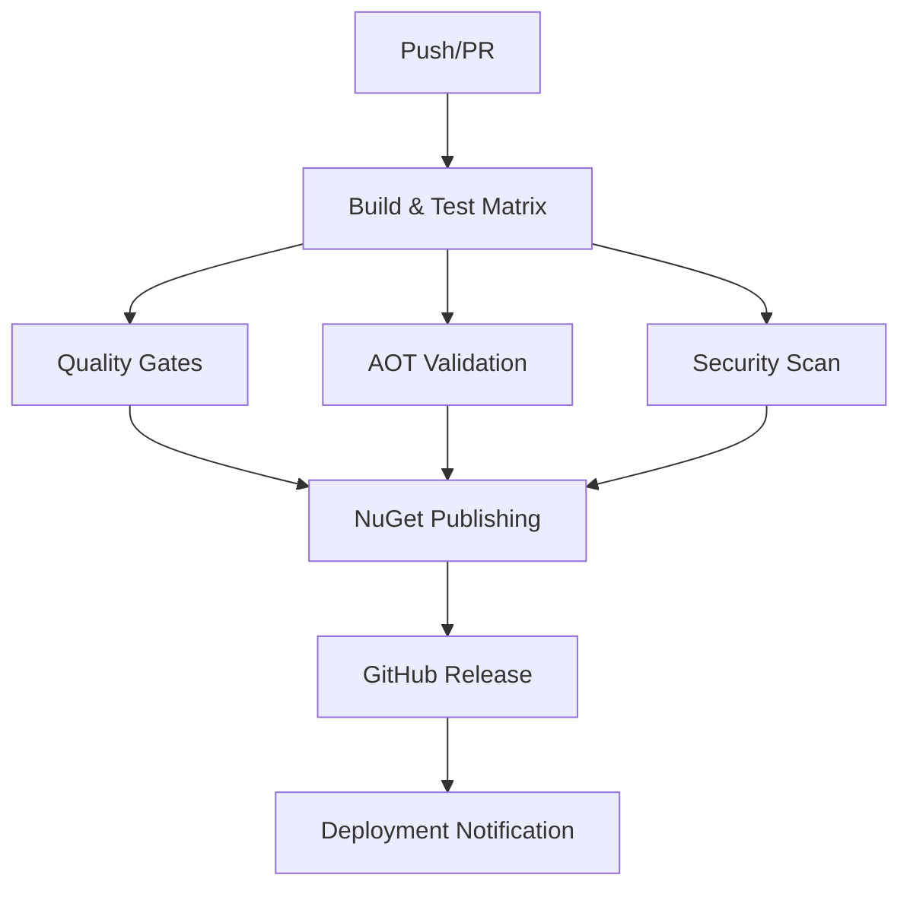

# DotCompute CI/CD Deployment Guide

This guide explains how to set up and manage the CI/CD pipeline for DotCompute alpha releases.

## Overview

The DotCompute CI/CD pipeline provides:

- ✅ **Cross-platform builds** (Windows, Linux, macOS)
- ✅ **Matrix testing** (Debug/Release configurations)
- ✅ **Automated testing** with coverage reporting
- ✅ **Quality gates** with 85% coverage threshold
- ✅ **Security scanning** with CodeQL
- ✅ **NuGet package** creation and publishing
- ✅ **GitHub releases** with automatic changelogs
- ✅ **Alpha/Beta release** support

## Pipeline Architecture



## Quick Start

### 1. Initial Setup

```bash
# Clone the repository
git clone https://github.com/your-org/dotcompute.git
cd dotcompute

# Set up the development environment
./scripts/ci/setup-environment.sh development
```

### 2. Local Build

```bash
# Run the full build pipeline locally
./.github/scripts/build.sh Release

# Run quality checks
./.github/scripts/quality-check.sh

# Generate coverage report
./scripts/ci/coverage-report.sh Html,Cobertura
```

### 3. Create Alpha Release

```bash
# Create an alpha release
./.github/scripts/release.sh 0.1.0-alpha.1 true
```

## GitHub Actions Configuration

### Required Secrets

Configure these secrets in your GitHub repository:

| Secret | Description | Example |
|--------|-------------|---------|
| `NUGET_API_KEY` | NuGet.org API key for package publishing | `oy2...` |
| `CODECOV_TOKEN` | Codecov token for coverage reporting | `a1b2c3...` |

### Repository Settings

1. **Environments**: Create a `production` environment for release deployments
2. **Branch Protection**: Require status checks for `main` branch
3. **Actions Permissions**: Enable read/write permissions for GitHub token

## Workflow Triggers

### Automatic Triggers

- **Push to main/develop**: Full CI pipeline
- **Pull Requests**: Build and test validation
- **Tags**: Release pipeline with NuGet publishing

### Manual Triggers

```bash
# Trigger workflow manually
gh workflow run "CI/CD Pipeline" \
  --field create_release=true \
  --field skip_tests=false
```

## Release Process

### Alpha Releases

1. **Create Tag**: `git tag v0.1.0-alpha.1`
2. **Push Tag**: `git push origin v0.1.0-alpha.1`
3. **Monitor Pipeline**: Check GitHub Actions
4. **Verify Publication**: Check NuGet.org and GitHub Releases

### Stable Releases

1. **Update Version**: Update `Directory.Build.props`
2. **Create Tag**: `git tag v1.0.0`
3. **Push Tag**: `git push origin v1.0.0`
4. **Monitor Pipeline**: Verify stable release

## Quality Gates

The pipeline enforces these quality requirements:

### Build Requirements
- ✅ All platforms build successfully
- ✅ No compilation errors or warnings
- ✅ AOT compatibility maintained

### Test Requirements
- ✅ All unit tests pass
- ✅ Integration tests pass
- ✅ Code coverage ≥ 85%

### Security Requirements
- ✅ No known vulnerabilities in dependencies
- ✅ CodeQL security analysis passes
- ✅ No deprecated packages (warnings only)

## Configuration Files

### GitVersion Configuration

```yaml
# GitVersion.yml
mode: ContinuousDeployment
branches:
  main:
    increment: Minor
    prevent-increment-of-merged-branch-version: true
  develop:
    increment: Minor
    prevent-increment-of-merged-branch-version: false
  feature:
    increment: None
```

### Coverage Settings

```xml
<!-- coverlet.runsettings -->
<RunSettings>
  <DataCollectionRunSettings>
    <DataCollectors>
      <DataCollector friendlyName="XPlat code coverage">
        <Configuration>
          <Format>opencover,cobertura</Format>
          <Exclude>[*.Tests]*,[*.Benchmarks]*</Exclude>
          <IncludeTestAssembly>false</IncludeTestAssembly>
        </Configuration>
      </DataCollector>
    </DataCollectors>
  </DataCollectionRunSettings>
</RunSettings>
```

## Local Development

### Environment Setup

```bash
# Install required tools
dotnet tool install --global GitVersion.Tool
dotnet tool install --global dotnet-reportgenerator-globaltool

# Set up directories
mkdir -p artifacts/{packages,coverage,reports}
```

### Build Scripts

```bash
# Full build with tests
./scripts/ci/build.sh Release false

# Build without tests
./scripts/ci/build.sh Release true

# Quality check with fixes
./scripts/ci/quality-check.sh fix
```

### Coverage Analysis

```bash
# Generate HTML coverage report
./scripts/ci/coverage-report.sh Html

# Generate multiple formats
./scripts/ci/coverage-report.sh Html,Cobertura,JsonSummary
```

## Troubleshooting

### Common Issues

#### Build Failures

```bash
# Clean and rebuild
dotnet clean
rm -rf artifacts/
./scripts/ci/setup-environment.sh
dotnet restore
dotnet build
```

#### Coverage Issues

```bash
# Check coverage files exist
find artifacts/coverage -name "*.xml"

# Regenerate coverage report
rm -rf artifacts/coverage-reports/
./scripts/ci/coverage-report.sh Html
```

#### Package Issues

```bash
# Verify package contents
dotnet pack --verbosity detailed

# Check package metadata
nuget verify artifacts/packages/*.nupkg
```

### Debug Commands

```bash
# Check environment
dotnet --info
dotnet --list-sdks

# Validate GitVersion
gitversion /showVariable NuGetVersionV2

# Test coverage collection
dotnet test --collect:"XPlat Code Coverage" --logger:console
```

## Monitoring and Metrics

### Pipeline Metrics

- **Build Time**: Target < 15 minutes per platform
- **Test Execution**: Target < 5 minutes
- **Coverage Generation**: Target < 2 minutes
- **Package Creation**: Target < 1 minute

### Quality Metrics

- **Code Coverage**: Minimum 85%
- **Test Success Rate**: 100%
- **Security Scan**: Zero high-severity issues
- **Package Validation**: 100% success

## Advanced Configuration

### Custom Environments

```bash
# Production environment
./scripts/ci/setup-environment.sh production

# Staging environment  
./scripts/ci/setup-environment.sh staging
```

### Matrix Customization

Modify `.github/workflows/ci.yml` to customize build matrix:

```yaml
strategy:
  matrix:
    os: [ubuntu-latest, windows-latest, macos-latest]
    configuration: [Debug, Release]
    dotnet-version: ['8.0.x', '9.0.x']
```

### Package Customization

Update `Directory.Build.props` for package metadata:

```xml
<PropertyGroup>
  <PackageVersion>$(Version)</PackageVersion>
  <PackageDescription>High-performance compute library for .NET</PackageDescription>
  <PackageTags>compute;gpu;cuda;opencl;performance</PackageTags>
</PropertyGroup>
```

## Security Considerations

### Secret Management

- Store sensitive data in GitHub Secrets
- Use environment-specific deployments
- Rotate API keys regularly
- Monitor access logs

### Dependency Security

- Enable Dependabot security updates
- Regular security scans with CodeQL
- Monitor vulnerability databases
- Update dependencies promptly

## Support and Maintenance

### Regular Maintenance

- **Weekly**: Review failed builds and flaky tests
- **Monthly**: Update dependencies and tools
- **Quarterly**: Review and optimize pipeline performance

### Support Channels

- **Issues**: [GitHub Issues](https://github.com/your-org/dotcompute/issues)
- **Discussions**: [GitHub Discussions](https://github.com/your-org/dotcompute/discussions)
- **Documentation**: [Wiki](https://github.com/your-org/dotcompute/wiki)

---

For more information, see:
- [Contributing Guide](../CONTRIBUTING.md)
- [Build Troubleshooting](../BUILD_TROUBLESHOOTING.md)
- [Testing Strategy](../TESTING_STRATEGY.md)