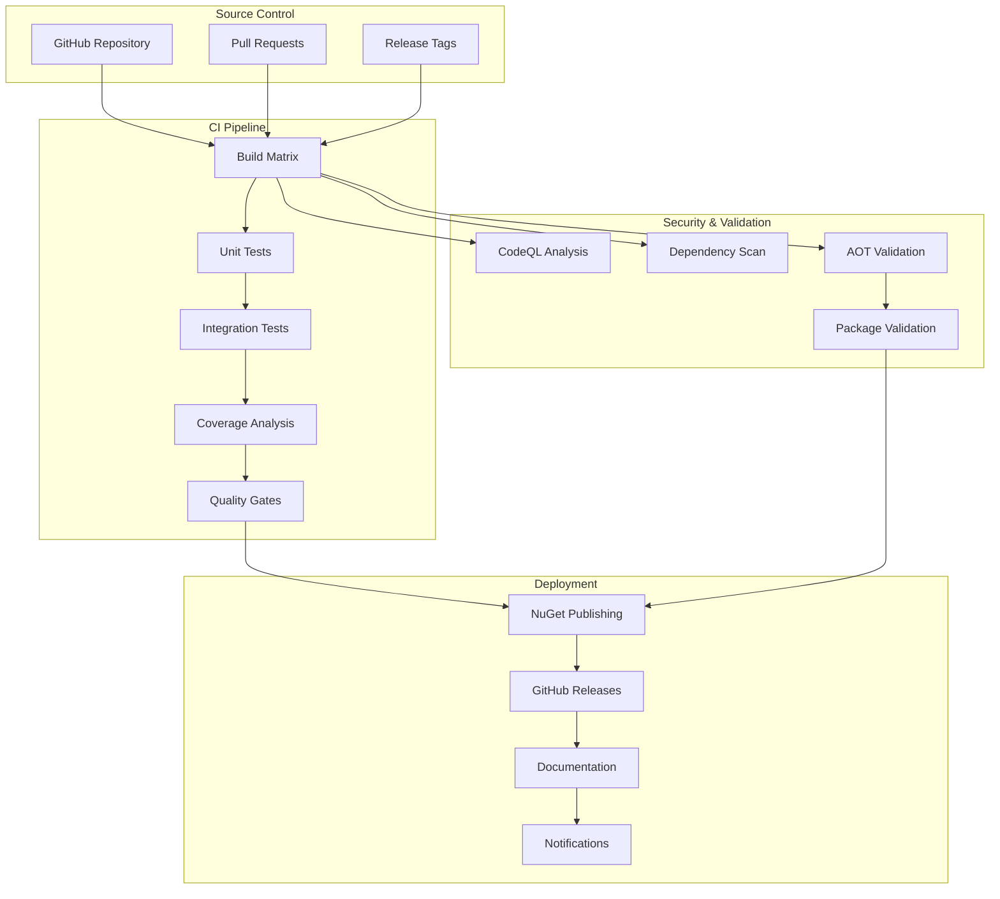

# DotCompute CI/CD Pipeline Overview

## Architecture Overview

The DotCompute CI/CD pipeline is designed for high-quality, automated delivery of .NET compute libraries with comprehensive testing, quality assurance, and deployment automation.



## Pipeline Stages

### 1. Build and Test Matrix

**Purpose**: Ensure cross-platform compatibility and configuration coverage

**Platforms**:
- Ubuntu Latest (Linux)
- Windows Latest  
- macOS Latest

**Configurations**:
- Debug (Development testing)
- Release (Production builds)

**Outputs**:
- Compiled assemblies
- Test results
- Coverage reports
- NuGet packages (Release only)

### 2. Quality Assurance

**Code Quality Checks**:
- ✅ Code formatting (dotnet format)
- ✅ Static analysis
- ✅ Compilation warnings
- ✅ Documentation completeness

**Test Quality**:
- ✅ Unit test execution
- ✅ Integration test execution
- ✅ Test coverage analysis (≥85% threshold)
- ✅ Performance regression detection

**Package Quality**:
- ✅ Package metadata validation
- ✅ Dependency analysis
- ✅ AOT compatibility verification

### 3. Security Scanning

**Static Analysis**:
- CodeQL security analysis
- Dependency vulnerability scanning
- License compliance checking

**Dynamic Analysis**:
- Runtime security testing
- Memory safety validation
- Performance security assessment

### 4. Release Management

**Version Management**:
- GitVersion-based semantic versioning
- Automatic version bumping
- Pre-release and stable release support

**Package Publishing**:
- NuGet.org publication
- Symbol package publishing
- Multiple package format support

**Release Documentation**:
- Automatic changelog generation
- Release notes compilation
- API documentation updates

## Workflow Triggers

### Push Events

```yaml
on:
  push:
    branches: [main, develop]
    tags: ['v*.*.*', '*.*.*-alpha*', '*.*.*-beta*', '*.*.*-rc*']
```

**Behavior**:
- **main/develop**: Full CI pipeline without publishing
- **tags**: Full CI/CD pipeline with publishing

### Pull Request Events

```yaml
on:
  pull_request:
    branches: [main, develop]
```

**Behavior**:
- Build and test validation
- Quality gate enforcement
- Security scanning
- No publishing

### Manual Dispatch

```yaml
on:
  workflow_dispatch:
    inputs:
      create_release:
        description: 'Create GitHub Release'
        type: boolean
      skip_tests:
        description: 'Skip tests'
        type: boolean
```

**Behavior**:
- On-demand pipeline execution
- Configurable options
- Debug and testing support

## Quality Gates

### Build Quality Gates

| Gate | Requirement | Action on Failure |
|------|-------------|------------------|
| **Compilation** | Zero errors | ❌ Fail pipeline |
| **Warnings** | Warnings allowed | ⚠️ Continue with warning |
| **Format** | Consistent code style | ⚠️ Continue with warning |

### Test Quality Gates

| Gate | Requirement | Action on Failure |
|------|-------------|------------------|
| **Unit Tests** | 100% pass rate | ❌ Fail pipeline |
| **Integration Tests** | 100% pass rate | ❌ Fail pipeline |
| **Code Coverage** | ≥85% line coverage | ❌ Fail pipeline |
| **Performance** | No regressions | ⚠️ Continue with warning |

### Security Quality Gates

| Gate | Requirement | Action on Failure |
|------|-------------|------------------|
| **Vulnerabilities** | Zero high-severity | ❌ Fail pipeline |
| **Dependencies** | No critical issues | ❌ Fail pipeline |
| **CodeQL** | No security issues | ❌ Fail pipeline |

### Package Quality Gates

| Gate | Requirement | Action on Failure |
|------|-------------|------------------|
| **Metadata** | Complete package info | ❌ Fail pipeline |
| **Dependencies** | Valid version ranges | ❌ Fail pipeline |
| **AOT Compatibility** | Successful AOT build | ❌ Fail pipeline |

## Environment Configuration

### Development Environment

```bash
DOTNET_ENVIRONMENT=Development
ASPNETCORE_ENVIRONMENT=Development
TreatWarningsAsErrors=false
```

**Characteristics**:
- Detailed logging
- Debug symbols included
- Extended timeout values
- Development dependencies

### CI Environment

```bash
CI=true
DOTNET_SKIP_FIRST_TIME_EXPERIENCE=true
DOTNET_NOLOGO=true
DOTNET_CLI_TELEMETRY_OPTOUT=true
```

**Characteristics**:
- Optimized for automation
- Minimal output verbosity
- Deterministic builds
- Parallel execution

### Production Environment

```bash
DOTNET_ENVIRONMENT=Production
ContinuousIntegrationBuild=true
Deterministic=true
```

**Characteristics**:
- Optimized binaries
- Source linking enabled
- Reproducible builds
- Security hardened

## Performance Metrics

### Pipeline Performance Targets

| Stage | Target Duration | Timeout |
|-------|----------------|---------|
| **Build** | < 5 minutes | 15 minutes |
| **Unit Tests** | < 3 minutes | 10 minutes |
| **Integration Tests** | < 5 minutes | 15 minutes |
| **Security Scan** | < 10 minutes | 20 minutes |
| **Package Creation** | < 2 minutes | 5 minutes |
| **Total Pipeline** | < 20 minutes | 45 minutes |

### Resource Utilization

| Resource | Typical Usage | Maximum |
|----------|---------------|---------|
| **CPU** | 70-80% | 100% |
| **Memory** | 2-4 GB | 8 GB |
| **Disk** | 5-10 GB | 20 GB |
| **Network** | 100-500 MB | 2 GB |

## Artifact Management

### Build Artifacts

```
artifacts/
├── packages/           # NuGet packages
│   ├── *.nupkg        # Main packages
│   └── *.snupkg       # Symbol packages
├── coverage/          # Coverage data
│   ├── *.xml          # Coverage reports
│   └── *.json         # Coverage summaries
├── reports/           # Quality reports
│   ├── *.html         # HTML reports
│   └── *.sarif        # Security reports
└── logs/              # Build logs
    ├── build.log      # Build output
    └── test.log       # Test output
```

### Retention Policies

| Artifact Type | Retention Period | Purpose |
|---------------|------------------|---------|
| **Packages** | 90 days | Release distribution |
| **Coverage Reports** | 30 days | Quality tracking |
| **Test Results** | 7 days | Debugging |
| **Build Logs** | 14 days | Troubleshooting |

## Deployment Strategies

### Alpha Releases

**Trigger**: Tags matching `*.*.*-alpha*`

**Behavior**:
- Pre-release flag set to `true`
- Published to NuGet with pre-release tag
- GitHub release marked as pre-release
- Limited distribution

### Beta Releases

**Trigger**: Tags matching `*.*.*-beta*`

**Behavior**:
- Pre-release flag set to `true`
- Broader testing audience
- Feature-complete but may have bugs
- Documentation review

### Release Candidates

**Trigger**: Tags matching `*.*.*-rc*`

**Behavior**:
- Pre-release flag set to `true`
- Production-ready code
- Final testing phase
- Documentation complete

### Stable Releases

**Trigger**: Tags matching `v*.*.*` (without pre-release suffix)

**Behavior**:
- Pre-release flag set to `false`
- Full production release
- Complete documentation
- Broad distribution

## Monitoring and Alerting

### Pipeline Monitoring

**Metrics Tracked**:
- Build success/failure rates
- Test execution times
- Coverage trends
- Package download statistics

**Alerting Channels**:
- GitHub notifications
- Email alerts (failures)
- Slack integration (optional)
- Dashboard updates

### Quality Monitoring

**Metrics Tracked**:
- Code coverage trends
- Test stability
- Performance benchmarks
- Security scan results

**Reporting**:
- Weekly quality reports
- Monthly trend analysis
- Quarterly reviews
- Annual assessments

## Troubleshooting Guide

### Common Issues

#### Build Failures

```bash
# Check build logs
cat artifacts/logs/build.log

# Verify environment
dotnet --info
dotnet --list-sdks

# Clean and retry
dotnet clean
rm -rf artifacts/
dotnet restore
```

#### Test Failures

```bash
# Run specific test
dotnet test --filter "TestName"

# Generate detailed output
dotnet test --logger:"console;verbosity=detailed"

# Check test results
cat artifacts/logs/test.log
```

#### Coverage Issues

```bash
# Verify coverage collection
find artifacts/coverage -name "*.xml"

# Check coverage settings
cat coverlet.runsettings

# Regenerate reports
./scripts/ci/coverage-report.sh
```

### Support Resources

- **Documentation**: [GitHub Wiki](../../wiki)
- **Issues**: [GitHub Issues](../../issues)
- **Discussions**: [GitHub Discussions](../../discussions)
- **Support**: [Contact Information](../../docs/support.md)

---

This pipeline architecture ensures reliable, secure, and efficient delivery of DotCompute releases while maintaining high quality standards and comprehensive testing coverage.