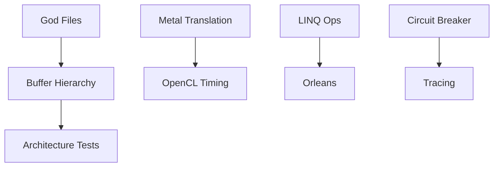
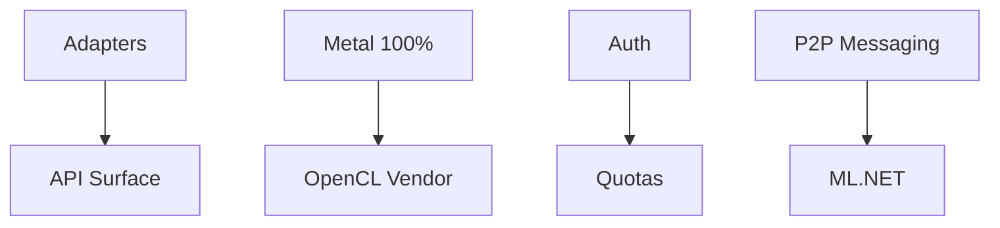
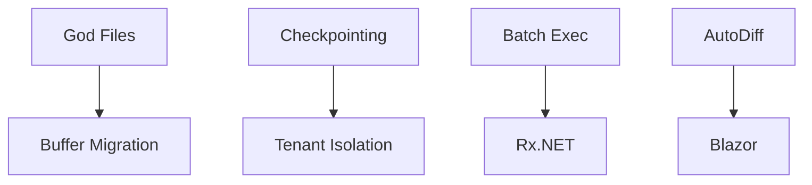

# DotCompute Implementation Plan Overview

**Document Version**: 1.1
**Last Updated**: January 2026
**Current Version**: v0.5.3
**Horizon**: v0.6.0 - v1.0.0 (12 months)
**Status**: Active

---

## Executive Summary

This document provides the master implementation plan for DotCompute's strategic roadmap. It defines four major phases aligned with releases v0.6.0 through v1.0.0, with detailed work breakdown, dependencies, testing requirements, and success criteria.

---

## Phase Overview

| Phase | Version | Codename | Duration | Theme |
|-------|---------|----------|----------|-------|
| **Phase 1** | v0.6.0 | Foundation | 3 months | Strengthen foundations |
| **Phase 2** | v0.7.0 | Enterprise | 3 months | Enterprise readiness |
| **Phase 3** | v0.8.0 | Scale | 3 months | Advanced capabilities |
| **Phase 4** | v1.0.0 | Production | 3 months | Production certification |

---

## Work Stream Organization

### Stream A: Code Quality & Architecture
- God file elimination
- Buffer consolidation
- Pattern extraction
- Architecture tests

### Stream B: Backend Platform
- Metal C# translation
- OpenCL stabilization
- Backend parity
- Cross-platform testing

### Stream C: Enterprise Features
- Resilience patterns
- Security controls
- Observability
- Resource governance

### Stream D: Developer Experience
- LINQ completion
- Tooling
- Documentation
- Ecosystem integration

---

## Phase 1: Foundation (v0.6.0)

**Duration**: Months 1-3
**Target Release**: May 2026

### Objectives
1. Establish architectural foundations for scale
2. Complete core LINQ operations
3. Begin Metal backend maturation
4. Implement basic enterprise resilience

### Key Deliverables

| ID | Deliverable | Stream | Priority | Effort |
|----|-------------|--------|----------|--------|
| F1.1 | God file elimination (50 files) | A | P0 | L |
| F1.2 | Buffer hierarchy refactoring | A | P0 | L |
| F1.3 | Architecture test suite | A | P0 | M |
| F1.4 | Metal C# translation (60%→85%) | B | P0 | L |
| F1.5 | OpenCL timing provider | B | P1 | M |
| F1.6 | LINQ Join/GroupBy/OrderBy | D | P0 | L |
| F1.7 | Circuit breaker pattern | C | P1 | M |
| F1.8 | Distributed tracing | C | P1 | M |
| F1.9 | CLI tooling | D | P2 | M |
| F1.10 | Orleans integration | D | P1 | M |

**Effort**: S (1-2 weeks), M (2-4 weeks), L (4-8 weeks)

### Dependencies



### Testing Requirements
- Unit test coverage: 95%+
- Integration tests for new LINQ operations
- Hardware tests for Metal/OpenCL changes
- Architecture tests: 100% pass rate
- Performance regression: <5% degradation

**Detailed Plan**: [Phase 1 Implementation](./PHASE-1-FOUNDATION.md)

---

## Phase 2: Enterprise (v0.7.0)

**Duration**: Months 4-6
**Target Release**: August 2026

### Objectives
1. Complete ports and adapters architecture
2. Achieve Metal production readiness
3. Implement enterprise security controls
4. Enable multi-GPU messaging

### Key Deliverables

| ID | Deliverable | Stream | Priority | Effort |
|----|-------------|--------|----------|--------|
| E2.1 | Backend adapter implementation | A | P0 | L |
| E2.2 | API surface project | A | P1 | M |
| E2.3 | Metal C# translation (85%→100%) | B | P0 | L |
| E2.4 | OpenCL vendor testing | B | P1 | M |
| E2.5 | Authentication & authorization | C | P0 | L |
| E2.6 | Resource quotas | C | P1 | M |
| E2.7 | Auto-tuning | D | P1 | M |
| E2.8 | GPU-to-GPU messaging | D | P0 | L |
| E2.9 | ML.NET integration | D | P2 | M |
| E2.10 | Graceful degradation | C | P1 | M |

### Dependencies



### Testing Requirements
- Security penetration testing
- Multi-vendor OpenCL validation
- Metal performance benchmarks
- Load testing for auth/quotas
- Cross-GPU messaging validation

**Detailed Plan**: [Phase 2 Implementation](./PHASE-2-ENTERPRISE.md)

---

## Phase 3: Scale (v0.8.0)

**Duration**: Months 7-9
**Target Release**: November 2026

### Objectives
1. Complete code consolidation
2. Implement advanced compute features
3. Expand platform support
4. Enable tenant isolation

### Key Deliverables

| ID | Deliverable | Stream | Priority | Effort |
|----|-------------|--------|----------|--------|
| S3.1 | Final god file elimination (<200) | A | P0 | L |
| S3.2 | Complete buffer migration | A | P0 | M |
| S3.3 | OpenCL barrier implementation | B | P1 | M |
| S3.4 | State checkpointing | C | P1 | L |
| S3.5 | Batch execution | D | P0 | M |
| S3.6 | Tenant isolation | C | P1 | L |
| S3.7 | Reactive Extensions | D | P2 | M |
| S3.8 | Automatic differentiation | D | P2 | L |
| S3.9 | Blazor WebAssembly | D | P2 | M |
| S3.10 | Hot configuration reload | C | P1 | M |

### Dependencies



### Testing Requirements
- Chaos engineering tests
- Multi-tenant isolation validation
- WebAssembly compatibility testing
- State recovery testing
- Long-running stability tests

**Detailed Plan**: [Phase 3 Implementation](./PHASE-3-SCALE.md)

---

## Phase 4: Production (v1.0.0)

**Duration**: Months 10-12
**Target Release**: February 2027

### Objectives
1. Freeze and stabilize public API
2. Complete production certification
3. Security audit and remediation
4. Performance validation and optimization

### Key Deliverables

| ID | Deliverable | Stream | Priority | Effort |
|----|-------------|--------|----------|--------|
| P4.1 | API freeze | A | P0 | M |
| P4.2 | API compatibility analyzer | A | P0 | M |
| P4.3 | All backends production ready | B | P0 | L |
| P4.4 | Security audit | C | P0 | L |
| P4.5 | Performance validation | D | P0 | M |
| P4.6 | Documentation completion | D | P0 | L |
| P4.7 | Sample applications | D | P1 | M |
| P4.8 | Migration guides | D | P1 | M |
| P4.9 | Certification program | D | P2 | M |
| P4.10 | Breaking change documentation | A | P0 | M |

### Testing Requirements
- Full regression test suite
- Security audit remediation verification
- Performance benchmark certification
- Documentation review
- Third-party validation

**Detailed Plan**: [Phase 4 Implementation](./PHASE-4-PRODUCTION.md)

---

## Cross-Phase Testing Strategy

### Test Pyramid

```
                    ┌──────────────┐
                    │   E2E/Perf   │  5%
                    │    Tests     │
                ┌───┴──────────────┴───┐
                │   Integration Tests  │  20%
            ┌───┴──────────────────────┴───┐
            │       Unit Tests             │  75%
            └──────────────────────────────┘
```

### Testing Cadence

| Test Type | Frequency | Trigger |
|-----------|-----------|---------|
| Unit Tests | Every commit | CI |
| Integration Tests | Every PR | CI |
| Hardware Tests | Daily | Scheduled |
| Performance Tests | Weekly | Scheduled |
| Security Tests | Monthly | Scheduled |
| Chaos Tests | Monthly | Scheduled |

### Quality Gates

| Gate | Criteria | Blocking |
|------|----------|----------|
| G1: Unit | 95% coverage, 0 failures | Yes |
| G2: Integration | 0 failures | Yes |
| G3: Performance | <5% regression | Yes |
| G4: Security | 0 critical/high | Yes |
| G5: Documentation | 100% public API | No |

**Detailed Strategy**: [Testing Strategy](./TESTING-STRATEGY.md)

---

## Risk Management

### Technical Risks

| Risk | Probability | Impact | Mitigation |
|------|-------------|--------|------------|
| Metal translation delays | Medium | High | Prioritize MSL direct path |
| OpenCL fragmentation | High | Medium | Vendor-specific adapters |
| Breaking API changes | Medium | High | Deprecation cycle |
| Performance regression | Low | High | Continuous benchmarking |

### Schedule Risks

| Risk | Probability | Impact | Mitigation |
|------|-------------|--------|------------|
| Scope creep | Medium | Medium | Strict change control |
| Resource constraints | Medium | Medium | Prioritization framework |
| Integration delays | Low | Medium | Interface-first development |
| Testing bottlenecks | Medium | Medium | Parallel test execution |

---

## Resource Allocation

### Team Structure

| Role | Phase 1 | Phase 2 | Phase 3 | Phase 4 |
|------|---------|---------|---------|---------|
| Core Architecture | 2 | 2 | 1 | 1 |
| Backend Platform | 2 | 2 | 2 | 1 |
| Enterprise Features | 1 | 2 | 2 | 1 |
| Developer Experience | 1 | 1 | 2 | 2 |
| QA/Testing | 1 | 2 | 2 | 3 |
| **Total** | **7** | **9** | **9** | **8** |

### Infrastructure Requirements

| Resource | Phase 1 | Phase 2 | Phase 3 | Phase 4 |
|----------|---------|---------|---------|---------|
| NVIDIA GPUs | 4 | 8 | 8 | 8 |
| Apple Silicon | 2 | 4 | 4 | 4 |
| AMD GPUs | 0 | 2 | 4 | 4 |
| Intel GPUs | 0 | 1 | 2 | 2 |
| CI/CD runners | 8 | 16 | 16 | 24 |

---

## Success Criteria

### Phase Completion Criteria

| Phase | Unit Coverage | Integration Pass | Perf Baseline | Security |
|-------|---------------|------------------|---------------|----------|
| Phase 1 | 95% | 100% | Established | N/A |
| Phase 2 | 96% | 100% | <3% regression | Audit scheduled |
| Phase 3 | 97% | 100% | <5% regression | Controls verified |
| Phase 4 | 98% | 100% | <5% regression | Audit passed |

### Release Readiness Checklist

- [ ] All P0 deliverables complete
- [ ] All P1 deliverables complete or deferred with approval
- [ ] Quality gates passed
- [ ] Documentation updated
- [ ] Migration guide published (if breaking changes)
- [ ] Performance benchmarks published
- [ ] Security review complete

---

## Communication Plan

### Stakeholder Updates

| Audience | Frequency | Format |
|----------|-----------|--------|
| Core Team | Daily | Standup |
| Extended Team | Weekly | Status meeting |
| Leadership | Bi-weekly | Executive summary |
| Community | Monthly | Blog post / Discord |

### Milestone Reviews

| Milestone | Timing | Participants |
|-----------|--------|--------------|
| Phase Start | Day 1 | Full team |
| Mid-Phase | Week 6 | Core + leads |
| Phase End | Week 12 | Full team + stakeholders |

---

## Document Index

| Document | Purpose |
|----------|---------|
| [PHASE-1-FOUNDATION.md](./PHASE-1-FOUNDATION.md) | Phase 1 detailed plan |
| [PHASE-2-ENTERPRISE.md](./PHASE-2-ENTERPRISE.md) | Phase 2 detailed plan |
| [PHASE-3-SCALE.md](./PHASE-3-SCALE.md) | Phase 3 detailed plan |
| [PHASE-4-PRODUCTION.md](./PHASE-4-PRODUCTION.md) | Phase 4 detailed plan |
| [TESTING-STRATEGY.md](./TESTING-STRATEGY.md) | Testing approach |

---

**Document Owner**: Technical Program Management
**Review Cycle**: Monthly
**Next Review**: February 2026
