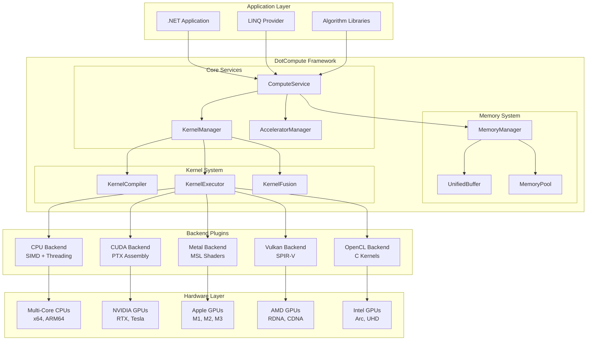
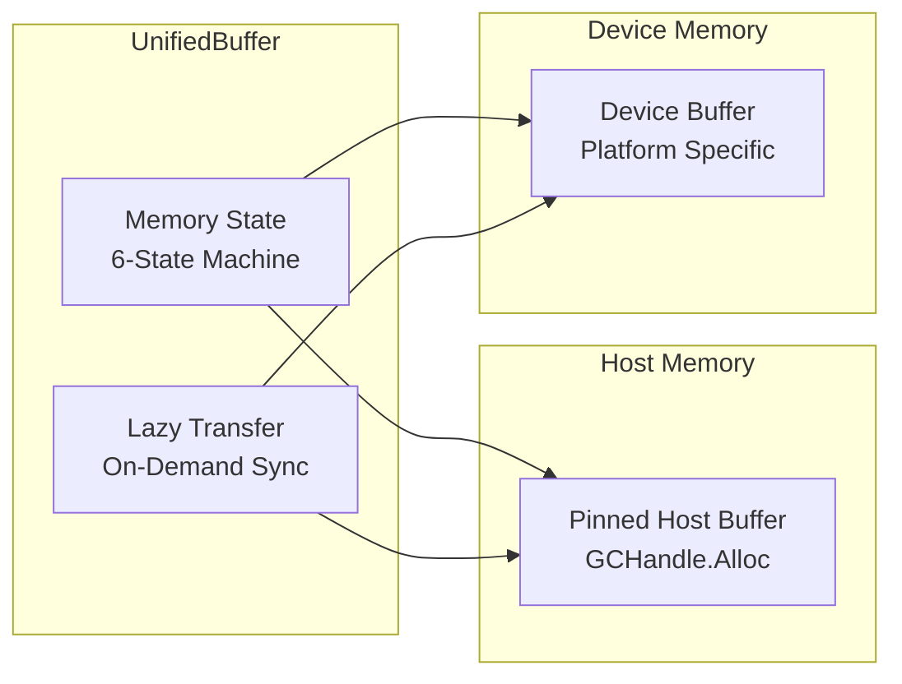

# DotCompute Architecture

This document provides a comprehensive overview of DotCompute's system architecture, design principles, and component interactions.

## 🎯 Design Principles

DotCompute is built on four core principles that guide every architectural decision:

### 1. **Native AOT First**
- **Zero Runtime Codegen**: All kernels are compiled at build time
- **Static Analysis**: Leverage compile-time optimizations
- **Minimal Runtime**: Sub-10ms startup with < 1MB overhead
- **Predictable Performance**: No JIT compilation delays

### 2. **Performance by Design**
- **Zero-Copy Operations**: Direct memory access without copying
- **SIMD Vectorization**: Hardware acceleration on all platforms
- **Memory Pooling**: Eliminate allocation overhead
- **Kernel Fusion**: Automatic operation combining

### 3. **Universal Backends**
- **Abstraction Layer**: Unified API across all compute devices
- **Backend Plugins**: Modular architecture for extensibility
- **Automatic Selection**: Runtime backend optimization
- **Graceful Fallback**: Always functional on any hardware

### 4. **Developer Experience**
- **C# Kernels**: Familiar syntax and tooling
- **Type Safety**: Compile-time error detection
- **IntelliSense**: Full IDE support and debugging
- **Hot Reload**: Real-time development workflow

## 🏗️ System Architecture



## 📦 Component Overview

### Core Framework (`DotCompute.Core`)

The foundation layer providing essential abstractions and services.

#### Key Components:
- **`IComputeService`** - Main entry point for kernel execution
- **`IAccelerator`** - Hardware device abstraction
- **`IKernel`** - Compute kernel definition
- **`IMemoryManager`** - Memory allocation and transfer

#### Responsibilities:
- Kernel registration and compilation
- Backend selection and management
- Memory allocation coordination
- Error handling and diagnostics

### Memory System (`DotCompute.Memory`)

Advanced memory management with zero-copy operations and intelligent pooling.

#### Key Components:
- **`UnifiedBuffer<T>`** - Host/device memory coordination
- **`MemoryPool<T>`** - Power-of-2 bucket allocation
- **`MemoryAllocator`** - Platform-optimized allocation
- **`UnsafeMemoryOperations`** - SIMD memory operations

#### Features:
- **Lazy Transfer**: Data moved only when needed
- **State Tracking**: Six-state memory synchronization
- **Memory Pooling**: 90% allocation reduction
- **SIMD Operations**: Vectorized memory operations

```csharp
// Memory state machine
enum BufferState
{
    Uninitialized,  // No data allocated
    HostOnly,       // Data only on host
    DeviceOnly,     // Data only on device
    Synchronized,   // Host and device in sync
    HostDirty,      // Host has newer data
    DeviceDirty     // Device has newer data
}
```

### Kernel System

Compilation, optimization, and execution pipeline for compute kernels.

#### Compilation Pipeline:
1. **Source Analysis** - Parse C# kernel methods
2. **IR Generation** - Convert to intermediate representation
3. **Optimization** - Apply fusion and vectorization
4. **Backend Codegen** - Generate platform-specific code
5. **Caching** - Store compiled kernels for reuse

#### Kernel Fusion:
```csharp
// Automatic fusion of consecutive operations
var data = input
    .Apply(NormalizeKernel)    // ↓
    .Apply(GaussianBlur)       // ↓ Fused into single kernel
    .Apply(EdgeDetection);     // ↓
```

## 🔌 Backend Architecture

DotCompute uses a plugin-based backend system for maximum flexibility and performance.

### Backend Interface

```csharp
public interface IComputeBackend
{
    string Name { get; }
    BackendCapabilities Capabilities { get; }
    
    ValueTask<IAccelerator> CreateAcceleratorAsync(int deviceId = 0);
    ValueTask<bool> IsAvailableAsync();
    ValueTask<IReadOnlyList<DeviceInfo>> GetDevicesAsync();
}
```

### CPU Backend (`DotCompute.Backends.CPU`)

High-performance multi-threaded backend with SIMD vectorization.

#### Features:
- **SIMD Detection**: Runtime capability detection (AVX512, AVX2, NEON)
- **Work Stealing**: Efficient thread pool with load balancing
- **Memory Affinity**: NUMA-aware memory allocation
- **Vectorization**: Automatic 4-16x speedup

#### Architecture:
```csharp
public class CpuAccelerator : IAccelerator
{
    private readonly SimdCapabilities _simd;
    private readonly CpuThreadPool _threadPool;
    private readonly CpuMemoryManager _memory;
    
    public async ValueTask<ICompiledKernel> CompileKernelAsync(
        KernelDefinition definition,
        CompilationOptions options)
    {
        // 1. Analyze kernel for vectorization opportunities
        var analysis = AnalyzeKernel(definition);
        
        // 2. Generate SIMD-optimized code
        var vectorizedCode = GenerateVectorizedCode(analysis, _simd);
        
        // 3. Create executable kernel
        return new CpuCompiledKernel(vectorizedCode, _threadPool);
    }
}
```

### CUDA Backend (`DotCompute.Backends.CUDA`) - Phase 3

NVIDIA GPU acceleration with PTX assembly support.

#### Features:
- **PTX Assembly**: Inline assembly for maximum performance
- **Cooperative Groups**: Advanced GPU programming models
- **Unified Memory**: Automatic host/device migration
- **Multi-GPU**: Scaling across multiple devices

### Metal Backend (`DotCompute.Backends.Metal`) - Phase 3

Apple GPU acceleration for macOS and iOS.

#### Features:
- **Metal Shading Language**: Native MSL kernel compilation
- **Argument Buffers**: Efficient parameter passing
- **Indirect Command Buffers**: GPU-driven execution
- **Neural Engine**: Integration with Apple's ML hardware

## 🧠 Memory Architecture

DotCompute's memory system is designed for maximum performance with minimal overhead.

### Unified Buffer System



### Memory Pool Architecture

Power-of-2 bucket allocation for efficient memory reuse:

```csharp
// Bucket sizes: 64, 128, 256, 512, 1K, 2K, 4K, 8K, 16K, 32K, 64K, ...
public class MemoryPool<T> where T : unmanaged
{
    private readonly ConcurrentQueue<T[]>[] _buckets;
    
    public T[] Rent(int minimumLength)
    {
        var bucketIndex = GetBucketIndex(minimumLength);
        
        if (_buckets[bucketIndex].TryDequeue(out var array))
            return array; // Reuse existing
            
        return new T[GetBucketSize(bucketIndex)]; // Allocate new
    }
}
```

### Memory Performance Characteristics

| Operation | Latency | Bandwidth | Notes |
|-----------|---------|-----------|-------|
| Pool Allocation | 10-50 μs | N/A | 95% reuse rate |
| Host-Device Transfer | 100-1000 μs | 8-12 GB/s | PCIe bottleneck |
| Device-Device Transfer | 10-50 μs | 100-500 GB/s | On-chip bandwidth |
| SIMD Memory Copy | 1-10 μs | 20-50 GB/s | CPU cache limited |

## 🔄 Execution Pipeline

The kernel execution pipeline optimizes for both latency and throughput:

### 1. Kernel Registration
```csharp
[Kernel("VectorAdd")]
public static void VectorAdd(KernelContext ctx, ...) { }

// Compiled at build time to:
KernelRegistry.Register("VectorAdd", new KernelDefinition
{
    Name = "VectorAdd",
    Parameters = [...],
    Source = new CompiledKernelSource(...)
});
```

### 2. Backend Selection
```csharp
public async ValueTask<IAccelerator> SelectBackendAsync(KernelDefinition kernel)
{
    // 1. Check device availability
    var availableBackends = await GetAvailableBackendsAsync();
    
    // 2. Analyze kernel requirements
    var requirements = AnalyzeKernel(kernel);
    
    // 3. Score backends by performance potential
    var scores = ScoreBackends(availableBackends, requirements);
    
    // 4. Select highest scoring backend
    return scores.OrderByDescending(s => s.Score).First().Backend;
}
```

### 3. Memory Preparation
```csharp
public async ValueTask PrepareMemoryAsync(object[] arguments)
{
    foreach (var arg in arguments.OfType<IMemoryBuffer>())
    {
        // Ensure data is available on target device
        await arg.EnsureDeviceLocationAsync();
    }
}
```

### 4. Kernel Execution
```csharp
public async ValueTask ExecuteAsync(ICompiledKernel kernel, object[] args)
{
    // 1. Set up execution context
    var context = CreateExecutionContext(args);
    
    // 2. Launch kernel
    await kernel.ExecuteAsync(context);
    
    // 3. Synchronize if needed
    await SynchronizeAsync();
}
```

## 📊 Performance Architecture

DotCompute is designed for extreme performance across all dimensions:

### Startup Performance
- **Cold Start**: < 10ms from process start to first kernel execution
- **Memory Overhead**: < 1MB runtime footprint
- **Binary Size**: < 10MB self-contained executable

### Execution Performance
- **Kernel Launch**: < 10μs overhead per kernel
- **Memory Bandwidth**: > 80% of theoretical peak
- **CPU Utilization**: > 90% on available cores
- **GPU Utilization**: > 85% on supported devices

### Scalability
- **Linear Scaling**: Performance scales with core/compute unit count
- **Multi-Device**: Automatic work distribution across devices
- **Memory Scaling**: Efficient handling of GB-scale datasets

## 🔮 Future Architecture

### Phase 3: Advanced Backends
- **CUDA Backend**: NVIDIA GPU acceleration with PTX assembly
- **Metal Backend**: Apple GPU acceleration with MSL
- **Distributed Computing**: Multi-node execution

### Phase 4: Advanced Features
- **LINQ Provider**: Automatic query optimization and vectorization
- **Algorithm Libraries**: Optimized linear algebra, FFT, ML primitives
- **JIT Specialization**: Runtime kernel optimization

### Phase 5: Ecosystem
- **Visual Debugger**: Step-through kernel debugging
- **Performance Profiler**: Detailed performance analysis
- **Cloud Integration**: Serverless compute execution

## 🤝 Extensibility

DotCompute's architecture is designed for easy extension:

### Custom Backends
```csharp
public class MyCustomBackend : IComputeBackend
{
    public string Name => "MyCustom";
    
    public async ValueTask<IAccelerator> CreateAcceleratorAsync(int deviceId)
    {
        return new MyCustomAccelerator();
    }
}

// Register in DI container
services.AddSingleton<IComputeBackend, MyCustomBackend>();
```

### Custom Memory Managers
```csharp
public class MyMemoryManager : IMemoryManager
{
    public async ValueTask<IMemoryBuffer> AllocateAsync(long sizeInBytes)
    {
        // Custom allocation logic
        return new MyMemoryBuffer(sizeInBytes);
    }
}
```

### Custom Algorithms
```csharp
public static class CustomAlgorithms
{
    [Kernel("CustomFFT")]
    public static void FastFourierTransform(
        KernelContext ctx,
        ReadOnlySpan<Complex> input,
        Span<Complex> output)
    {
        // Custom FFT implementation
    }
}
```

This architecture provides the foundation for a universal, high-performance compute framework that scales from embedded devices to data centers while maintaining excellent developer experience and Native AOT compatibility.